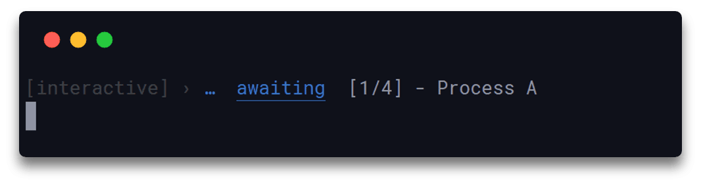

<h1 align="center">
  Signale
</h1>

<h4 align="center">
  Librari regjistrimi shumë e konfigurueshëme
</h4>

<div align="center">
  
</div>

<p align="center">
  <a href="https://www.npmjs.com/package/signale">
    
  </a>
</p>

<div align="center">
  <br>
  <sup><b>Sponsorizuar nga:</b></sup>
  <br>
  <a href="https://betterstack.com">
    <div>
      
    </div>
    <sup>
      Zbulo, Zgjidh dhe Parandaloni Kohën e Pushimit.
    </sup>
  </a>
</div>

## Përshkrimi

Plotësisht i modifikueshëm dhe i konfigurueshëm deri në thelb, signale mund të përdoret për qëllime regjistrimi, raportim statusi, si dhe për menaxhimin e procesit të shfaqjes së output-it të moduleve dhe aplikacioneve të tjera të node.

Lexoni këtë dokument në: [简体中文](https://github.com/klaudiosinani/signale/blob/master/docs/readme.zh_CN.md).

Tani mund të mbështetni procesin e zhvillimit përmes [GitHub Sponsors](https://github.com/sponsors/klaudiosinani).

Vizitoni [udhëzimet e kontributit](https://github.com/klaudiosinani/signale/blob/master/contributing.md#translating-documentation) për të mësuar më shumë se si të përktheni këtë dokument në më shumë gjuhë.

## Pikat Kryesore

- 19 regjistrues të gatshëm për përdorim
- Mund të modifikohet dhe personalizohet në çdo aspekt
- Output i pastër dhe estetikisht i bukur
- Kohëmatës të integruar
- Regjistrues të personalizueshëm
- Mbështetje për TypeScript
- Modalitete interaktive dhe të rregullta
- Filtrim sekretesh dhe informacioni të ndjeshëm
- Mbështetje për emra skedarësh, data dhe kohë
- Regjistrues dhe kohëmatës të fokusuar (scoped)
- Mekanizëm i niveleve të shkallëzuara të regjistrimit
- Mbështetje për interpolim string-jesh
- Shumë flukse të regjistrueshme të ndryshueshme
- Sintaksë e thjeshtë dhe minimale
- Konfigurim global përmes `package.json`
- Konfigurim i tejkalueshëm sipas skedari apo regjistruesi

## Përmbajtja

- [Përshkrimi](#përshkrimi)
- [Pikat Kryesore](#pikat-kryesore)
- [Instalimi](#instalimi)
- [Përdorimi](#përdorimi)
- [Konfigurimi](#konfigurimi)
- [API](#api)
- [Zhvillimi](#zhvillimi)
- [Të Lidhura](#të-lidhura)
- [Kush e përdor?](#kush-e-përdor)
- [Ekipi](#ekipi)
- [Sponsorët](#sponsorët)
- [Licenca](#licenca)

## Instalimi

### Yarn

```bash
yarn add signale
```

### NPM

```bash
npm install signale
```

## Përdorimi

### Regjistruesit e Paracaktuar

Importoni signale dhe filloni të përdorni ndonjërin nga regjistruesit e paracaktuar.

<details>
<summary>Shikoni të gjithë regjistruesit e disponueshëm.</summary>

<br/>

- `await`
- `complete`
- `error`
- `debug`
- `fatal`
- `fav`
- `info`
- `note`
- `pause`
- `pending`
- `star`
- `start`
- `success`
- `wait`
- `warn`
- `watch`
- `log`

</details>

<br/>

```js
const signale = require('signale');

signale.success('Operacioni u përfundua me sukses');
signale.debug('Përshëndetje', 'nga', 'L59');
signale.pending('Shkruaj shënime për versionin %s', '1.2.0');
signale.fatal(new Error('Nuk mund të merret pranga'));
signale.watch('Po monitorohet në mënyrë rekursive direktoria e ndërtimit...');
signale.complete({prefix: '[detyrë]', message: 'Rregullo çështjen #59', suffix: '(@klaudiosinani)'});
```

<div align="center">
  
</div>

### Regjistrues të Personalizuar

Për të krijuar një regjistrues të personalizuar, përcaktoni një objekt `options` që përmban fushën `types` me të dhënat e regjistruesit, dhe kalojeni si argument tek një instancë e re e signale.

```js
const {Signale} = require('signale');

const options = {
  disabled: false,
  interactive: false,
  logLevel: 'info',
  scope: 'custom',
  secrets: [],
  stream: process.stdout,
  types: {
    remind: {
      badge: '**',
      color: 'yellow',
      label: 'kujtesë',
      logLevel: 'info'
    },
    santa: {
      badge: '🎅',
      color: 'red',
      label: 'santa',
      logLevel: 'info'
    }
  }
};

const custom = new Signale(options);
custom.remind('Përmirësoni dokumentacionin.');
custom.santa('Hoho! Ke një variabël të papërdorur në L45.');
```

<div align="center">
  
</div>

Këtu është një shembull se si të tejkaloni regjistruesit `error` dhe `success` të paracaktuar.

```js
const {Signale} = require('signale');

const options = {
  types: {
    error: {
      badge: '!!',
      label: 'gabim fatal'
    },
    success: {
      badge: '++',
      label: 'sukses i madh'
    }
  }
};

const signale = new Signale();
signale.error('Regjistrimi i gabimit të paracaktuar');
signale.success('Regjistrimi i suksesit të paracaktuar');

const custom = new Signale(options);
custom.error('Regjistrimi i gabimit të personalizuar');
custom.success('Regjistrimi i suksesit të personalizuar');
```

<div align="center">
  
</div>

Objekti `options` mund të përmbajë secilën nga vetitë: `disabled`, `interactive`, `logLevel`, `secrets`, `stream`, `scope` dhe `types`.

##### `disabled`

- Tipi: `Boolean`
- Parazgjedhur: `false`

Çaktivizon funksionalitetin e regjistrimit për të gjithë regjistruesit që i përkasin instancës së krijuar.

##### `interactive`

- Tipi: `Boolean`
- Parazgjedhur: `false`

Kallon të gjithë regjistruesit në modalitet interaktiv.

##### `logLevel`

- Tipi: `String`
- Parazgjedhur: `'info'`

Vendos nivelin e përgjithshëm të regjistrimit të instancës së krijuar. Mund të jetë një nga sa vijon:

- `'info'` - Shfaq të gjitha mesazhet nga të gjithë regjistruesit.
- `'timer'` - Shfaq mesazhet vetëm nga regjistruesit `time`, `timeEnd`, `debug`, `warn`, `error` & `fatal`.
- `'debug'` - Shfaq mesazhet vetëm nga regjistruesit `debug`, `warn`, `error` & `fatal`.
- `'warn'` - Shfaq mesazhet vetëm nga regjistruesit `warn`, `error` & `fatal`.
- `'error'` - Shfaq mesazhet vetëm nga regjistruesit `error` & `fatal`.

##### `secrets`

- Tipi: `(String|Number)[]`
- Parazgjedhur: `[]`

Një varg që përmban sekrete/informacion të ndjeshëm për t'u hequr nga trupi dhe metadata e mesazheve që do regjistrohen dhe do të zëvendësohet me '[secure]'.

##### `stream`

- Tipi: `stream.Writable|stream.Writable[]`
- Parazgjedhur: `process.stdout`

Destinacioni ku të dhënat shkruhen, mund të jetë një [Writable stream](https://nodejs.org/api/stream.html#stream_writable_streams) ose një varg me më shumë flukse të tilla.

##### `scope`

- Tipi: `String|String[]`

Emri i kontekstit (scope) nga ku raporton regjistruesi.

##### `types`

- Tipi: `Object`

Përmban konfigurimin e regjistruesve të personalizuar ose paracaktuar.

Gjithashtu, objekti konfigurues i çdo tipi regjistruesi të personalizuar ose paracaktuar, mund të mbajë çdo nga këto veti: `badge`, `label`, `color`, `logLevel` & `stream`.

##### `badge`

- Tipi: `String`

Ikona që i përket regjistruesit.

##### `label`

- Tipi: `String`

Etiketa që identifikon llojin e regjistruesit.

##### `color`

- Tipi: `String`

Ngjyra e etiketës, mund të jetë çdo nga ngjyrat e mbështetura nga [chalk](https://github.com/chalk/chalk#colors).

##### `logLevel`

- Tipi: `String`
- Parazgjedhur: `'info'`

Niveli që i takon regjistruesit. Mesazhet shfaqen vetëm nëse niveli i tyre është më i lartë apo i barabartë me nivelin e përgjithshëm të instancës.

##### `stream`

- Tipi: `stream.Writable|stream.Writable[]`
- Parazgjedhur: `process.stdout`

Destinacioni ku të dhënat shkruhen, mund të jetë një stream i vetëm apo një varg streams.

### Regjistrues Me Scope

Për të krijuar një regjistrues me scope nga e para, përcaktoni fushën `scope` brenda objektit `options` dhe kalojeni tek një instancë e re të signale.

```js
const {Signale} = require('signale');

const options = {
  scope: 'scope global'
};

const global = new Signale(options);
global.success('Operacioni i suksesshëm');
```

<div align="center">
  
</div>

Për të krijuar një regjistrues me scope të bazuar mbi një ekzistues, përdorni funksionin `scope()`, i cili do të kthejë një instancë të re signale, duke trashëguar të gjithë regjistruesit e personalizuar, kohëmatësit, sekretet, fluret, konfigurimin, nivelin e regjistrimit, mënyrën interaktive dhe statuset e çaktivuara nga ai fillestar.

```js
const signale = require('signale');

const global = signale.scope('scope global');
global.success('Përshëndetje nga scope-i global');

function foo() {
  const outer = global.scope('outer', 'scope');
  outer.success('Përshëndetje nga scope-i i jashtëm');
  
  setTimeout(() => {
    const inner = outer.scope('inner', 'scope'); 
    inner.success('Përshëndetje nga scope-i i brendshëm');
  }, 500);
}

foo();
```

<div align="center">
  
</div>

### Regjistrues Interaktivë

Për të inicializuar një regjistrues interaktiv, krijoni një instancë të re signale me atributin [`interactive`](#interactive) të vendosur në `true`. Kur jeni në mënyrën interaktive, mesazhet e mëparshme të regjistuar nga një regjistrues interaktiv, do të tejkalohen vetëm nga të reja që vijnë nga i njëjti ose një regjistrues tjetër interaktiv. Vini re se mesazhet e rregullta nga regjistruesit e rregullt nuk tejkalohen nga ata interaktivë.

```js
const {Signale} = require('signale');

const interactive = new Signale({interactive: true, scope: 'interactive'});

interactive.await('[%d/4] - Procesi A', 1);

setTimeout(() => {
  interactive.success('[%d/4] - Procesi A', 2);
  setTimeout(() => {
    interactive.await('[%d/4] - Procesi B', 3);
    setTimeout(() => {
      interactive.error('[%d/4] - Procesi B', 4);
      setTimeout(() => {}, 1000);
    }, 1000);
  }, 1000);
}, 1000);
```

<div align="center">
  
</div>

### Flukse të Shkrueshme

Në mënyrë të parazgjedhur, të gjitha instancat signale regjistrojnë mesazhet e tyre në fluksin `process.stdout`. Kjo mund të modifikohet, për t'u përshtatur me preferencën tuaj, përmes vetisë [`stream`](#stream), ku mund të përcaktoni një ose më shumë flukse të vlefshme të Shkrueshme, të cilat do të përdoren nga të gjithë llojet e regjistruesve për të regjistruar të dhënat tuaja. Gjithashtu, është e mundur të përcaktohet një ose më shumë flukse të Shkrueshme ekskluzivisht për një lloj specifik regjistruesi, duke shkruar kështu të dhëna në mënyrë të pavarur nga llojet e tjera të regjistruesve.

```js
const {Signale} = require('signale');

const options = {
  stream: process.stderr, // Të gjithë regjistruesit do të shkruajnë tek `process.stderr`
  types: {
    error: {
      // Vetëm `error` do të shkruajë tek të dy `process.stdout` & `process.stderr`
      stream: [process.stdout, process.stderr]
    }
  }
};

const signale = new Signale(options);
signale.success('Mesazhi do të shfaqet në `process.stderr`');
signale.error('Mesazhi do të shfaqet në të dy `process.stdout` & `process.stderr`');
```

<div align="center">
  
</div>

### Filtrim Sekretesh

Duke shfrytëzuar opsionin `secrets`, sekretet dhe informacione të tjera të ndjeshme mund të filtrohen nga trupi si dhe metadata, p.sh. emrat e scope-ve etj, të mesazheve për t'u regjistruar. Opsioni është pjesë e objektit të konfigurimit që kalon tek një instancë `Signale` gjatë inicializimit të saj, dhe është i tipit `Array<String|Number>`. Vargu mund të mbajë shumë sekrete, të gjitha këto hiqen, nëse janë të pranishme, nga mesazhet për t'u regjistruar dhe zëvendësohen me string-un e parazgjedhur `'[secure]'`. Gjithashtu, kur përdoret funksioni unary `signale.scope(name)`, instanca e kthyer `Signale` trashëgon të gjitha sekretet që i përkasin prindit të saj. Procesi i kontrollit të sekreteve kryhet në mënyrë **case-sensitive**. Gjithashtu, funksioni unary [`signale.addSecrets()`](https://github.com/klaudiosinani/signale/blob/master/docs/readme.AL.md#signaleaddsecretssecrets) dhe ai nullary [`signale.clearSecrets()`](https://github.com/klaudiosinani/signale/blob/master/docs/readme.AL.md#signaleclearsecrets) janë të disponueshme përmes API-së për shtim dhe pastrimin e sekreteve përkatësisht.

Është **kritike** dhe **shumë e rekomanduar** të **mos i shkruani drejtpërdrejt sekretet në kodin tuaj**, kështu që shembulli në vijim shërben **vetëm** si një demonstrim përdorimi i thjeshtë dhe lehtësisht i riprodhuar.

```js
const {Signale} = require('signale');

// Në realitet sekretet mund të merren/deshkriptohen në mënyrë të sigurt përmes API-së së dedikuar 
const [USERNAME, TOKEN] = ['klaudiosinani', 'token'];

const logger1 = new Signale({
  secrets: [USERNAME, TOKEN]
});

logger1.log('$ exporting USERNAME=%s', USERNAME);
logger1.log('$ exporting TOKEN=%s', TOKEN);

// `logger2` trashëgon të gjitha sekretet nga prindi i tij `logger1`
const logger2 = logger1.scope('parent');

logger2.log('$ exporting USERNAME=%s', USERNAME);
logger2.log('$ exporting TOKEN=%s', TOKEN);
```

<div align="center">
  
</div>

### Kohëmatës

Kohëmatësit menaxhohen nga funksionet `time()` dhe `timeEnd()`. Një etiketë unike mund të përdoret për të identifikuar një kohëmatës në inicializim, megjithëse nëse asnjë nuk jepet, kohëmatësi do të marrë një automatikisht. Përveç kësaj, thirrja e funksionit `timeEnd()` pa një etiketë të specifikuar do të ketë si efekt terminimin e kohëmatësit më të rishtëm, që u krijua pa dhënë etiketë.

```js
const signale = require('signale');

signale.time('test');
signale.time();
signale.time();

setTimeout(() => {
  signale.timeEnd();
  signale.timeEnd();
  signale.timeEnd('test');
}, 500);
```

<div align="center">
  
</div>

## Konfigurimi

### Global

Për të aktivizuar konfigurimin global përcaktoni opsionet nën namespace-in `signale` në `package.json` tuaj.

Sa në vijim ilustron të gjitha opsionet e disponueshme me vlerat e tyre përkatëse të parazgjedhura.

```json
{
  "signale": {
    "displayScope": true,
    "displayBadge": true,
    "displayDate": false,
    "displayFilename": false,
    "displayLabel": true,
    "displayTimestamp": false,
    "underlineLabel": true,
    "underlineMessage": false,
    "underlinePrefix": false,
    "underlineSuffix": false,
    "uppercaseLabel": false
  }
}
```

<details>
<summary>Shikoni të gjitha opsionet e disponueshme në detaj.</summary>

##### `displayScope`

- Tipi: `Boolean`
- Parazgjedhur: `true`

Shfaq emrin e scope-it të regjistruesit.

##### `displayBadge`

- Tipi: `Boolean`
- Parazgjedhur: `true`

Shfaq stemën e regjistruesit.

##### `displayDate`

- Tipi: `Boolean`
- Parazgjedhur: `false`

Shfaq datën aktuale lokale në formatin `YYYY-MM-DD`.

##### `displayFilename`

- Tipi: `Boolean`
- Parazgjedhur: `false`

Shfaq emrin e skedarit nga i cili raporton regjistruesi.

##### `displayLabel`

- Tipi: `Boolean`
- Parazgjedhur: `true`

Shfaq etiketën e regjistruesit.

##### `displayTimestamp`

- Tipi: `Boolean`
- Parazgjedhur: `false`

Shfaq kohën aktuale lokale në formatin `HH:MM:SS`.

##### `underlineLabel`

- Tipi: `Boolean`
- Parazgjedhur: `true`

Nënvizon etiketën e regjistruesit.

##### `underlineMessage`

- Tipi: `Boolean`
- Parazgjedhur: `false`

Nënvizon mesazhin e regjistruesit.

##### `underlinePrefix`

- Tipi: `Boolean`
- Parazgjedhur: `false`

Nënvizon parashtesën e regjistruesit.

##### `underlineSuffix`

- Tipi: `Boolean`
- Parazgjedhur: `false`

Nënvizon prapashtesën e regjistruesit.

##### `uppercaseLabel`

- Tipi: `Boolean`
- Parazgjedhur: `false`

Shfaq etiketën e regjistruesit me shkronja të mëdha.

</details>

### Lokal

Për të aktivizuar konfigurimin lokal thirrni funksionin `config()` në instancën tuaj signale. Konfigurimet lokale do të tejkalojnë gjithmonë çdo konfigurim të mëparshëm të trashëguar nga `package.json`.

Në shembullin vijues, regjistruesit në skedarin `foo.js` do të ekzekutohen nën konfigurimin e tyre, duke tejkaluar atë në `package.json`.

```js
// foo.js
const signale = require('signale');

// Tejkalon çdo konfigurim ekzistues `package.json`
signale.config({
  displayFilename: true,
  displayTimestamp: true,
  displayDate: false
}); 

signale.success('Përshëndetje nga Scope-i Global');
```

<div align="center">
  
</div>

Gjithashtu, regjistruesit me scope mund të kenë konfigurimin e tyre të pavarur, duke tejkaluar atë të trashëguar nga instanca prind ose `package.json`.

```js
// foo.js
const signale = require('signale');

signale.config({
  displayFilename: true,
  displayTimestamp: true,
  displayDate: false
});

signale.success('Përshëndetje nga Scope-i Global');

function foo() {
  // `fooLogger` trashëgon konfigurimin e `signale`
  const fooLogger = signale.scope('foo scope');

  // Tejkalon të dy konfigurimet `signale` dhe `package.json`
  fooLogger.config({
    displayFilename: true,
    displayTimestamp: false,
    displayDate: true
  });

  fooLogger.success('Përshëndetje nga Scope-i Lokal');
}

foo();
```

<div align="center">
  
</div>

## API

#### signale.`<logger>(message[, message]|messageObj|errorObj)`

##### **`logger`**

- Tipi: `Function`

Mund të jetë çdo regjistrues i paracaktuar ose i personalizuar.

##### **`message`**

- Tipi: `String`

Mund të jetë një ose më shumë string-e të ndarë me presje.

```js
const signale = require('signale');

signale.success('Operacion i suksesshëm');
//=> ✔  success  Operacion i suksesshëm

signale.success('Operacion', 'i suksesshëm');
//=> ✔  success  Operacion i suksesshëm

signale.success('Operacion i %s', 'suksesshëm');
//=> ✔  success  Operacion i suksesshëm
```

##### **`errorObj`**

- Tipi: `Error Object`

Mund të jetë çdo objekt gabimi.

```js
const signale = require('signale');

signale.error(new Error('Operacion i pasuksesshëm'));
//=> ✖  error  Error: Operacion i pasuksesshëm
//        at Module._compile (module.js:660:30)
//        at Object.Module._extensions..js (module.js:671:10)
//        ...
```

##### **`messageObj`**

- Tipi: `Object`

Mund të jetë një objekt që përmban atributet `prefix`, `message` dhe `suffix`, me `prefix` dhe `suffix` gjithmonë të shtuar përpara dhe pas `message`-it përkatësisht.

```js
const signale = require('signale');

signale.complete({prefix: '[detyrë]', message: 'Rregullo çështjen #59', suffix: '(@klaudiosinani)'});
//=> [detyrë] ☒  complete  Rregullo çështjen #59 (@klaudiosinani)

signale.complete({prefix: '[detyrë]', message: ['Rregullo çështjen #%d', 59], suffix: '(@klaudiosinani)'});
//=> [detyrë] ☒  complete  Rregullo çështjen #59 (@klaudiosinani)
```

#### signale.`scope(name[, name])`

Përcakton emrin e scope-it të regjistruesit.

##### **`name`**

- Tipi: `String`

Mund të jetë një ose më shumë string-e të ndarë me presje.

```js
const signale = require('signale');

const foo = signale.scope('foo'); 
const fooBar = signale.scope('foo', 'bar');

foo.success('foo');
//=> [foo] › ✔  success  foo

fooBar.success('foo bar');
//=> [foo] [bar] › ✔  success  foo bar
```

#### signale.`unscope()`

Pastron emrin e scope-it të regjistruesit.

```js
const signale = require('signale');

const foo = signale.scope('foo'); 

foo.success('foo');
//=> [foo] › ✔  success  foo

foo.unscope();

foo.success('foo');
//=> ✔  success  foo
```

#### signale.`config(settingsObj)`

Vendos konfigurimin e një instance duke tejkaluar çdo konfigurim global ose lokal ekzistues.

##### **`settingsObj`**

- Tipi: `Object`

Mund të mbajë çdo nga [opsionet](#global) e dokumentuara.

```js
// foo.js
const signale = require('signale');

signale.config({
  displayFilename: true,
  displayTimestamp: true,
  displayDate: true
});

signale.success('Operacione të suksesshme');
//=> [2018-5-15] [11:12:38] [foo.js] › ✔  success  Operacione të suksesshme
```

#### signale.`time([, label])`

- Tipi i Kthimit: `String`

Vendos një kohëmatës dhe pranon një etiketë opsionale. Nëse asnjë nuk jepet, kohëmatësi do të marrë një etiketë unike automatikisht.

Kthen një string që korrespondon me etiketën e kohëmatësit.

##### **`label`**

- Tipi: `String`

Etiketa që korrespondon me kohëmatësin. Çdo kohëmatës duhet të ketë etiketën e tij unike.

```js
const signale = require('signale');

signale.time();
//=> ▶  timer_0  Inicializua kohëmatësi...

signale.time();
//=> ▶  timer_1  Inicializua kohëmatësi...

signale.time('etiketa');
//=> ▶  etiketa    Inicializua kohëmatësi...
```

#### signale.`timeEnd([, label])`

- Tipi i Kthimit: `Object`

Çaktivizon kohëmatësin të cilit i korrespondon etiketa e dhënë. Nëse nuk jepet etiketë, kohëmatësi më i fundit, që u krijua pa dhënë etiketë, do të çaktivizohet.

Kthen një objekt `{label, span}` që përmban etiketën e kohëmatësit dhe kohën totale të ekzekutimit.

##### **`label`**

- Tipi: `String`

Etiketa që korrespondon me kohëmatësin, çdo kohëmatës ka etiketën e tij unike.

```js
const signale = require('signale');

signale.time();
//=> ▶  timer_0  Inicializua kohëmatësi...

signale.time();
//=> ▶  timer_1  Inicializua kohëmatësi...

signale.time('etiketa');
//=> ▶  etiketa    Inicializua kohëmatësi...

signale.timeEnd();
//=> ◼  timer_1  Kohëmatësi funksionoi për: 2ms

signale.timeEnd();
//=> ◼  timer_0  Kohëmatësi funksionoi për: 2ms

signale.timeEnd('etiketa');
//=> ◼  etiketa    Kohëmatësi funksionoi për: 2ms
```

#### signale.`disable()`

Çaktivizon funksionalitetin e regjistrimit të të gjithë regjistruesve që i përkasin një instance specifike.

```js
const signale = require('signale');

signale.success('foo');
//=> ✔  success  foo

signale.disable();

signale.success('foo');
//=>
```

#### signale.`enable()`

Aktivizon funksionalitetin e regjistrimit të të gjithë regjistruesve që i përkasin një instance specifike.

```js
const signale = require('signale');

signale.disable();

signale.success('foo');
//=>

signale.enable();

signale.success('foo');
//=> ✔  success  foo
```

#### signale.`isEnabled()`

Kontrollon nëse funksionaliteti i regjistrimit të një instance specifike është i aktivizuar.

```js
const signale = require('signale');

signale.success('foo');
//=> ✔  success  foo

signale.isEnabled();
// => true

signale.disable();

signale.success('foo');
//=>

signale.isEnabled();
// => false
```

#### signale.`addSecrets(secrets)`

Shton sekrete/informacione të ndjeshme të reja në instancën e synuar Signale.

##### **`secrets`**

- Tipi: `(String|Number)[]`

Varg që përmban sekretet/informacionin e ndjeshëm për t'u filtruar.

```js
const signale = require('signale');

signale.log('$ exporting USERNAME=%s', 'klaudiosinani');
//=> $ exporting USERNAME=klaudiosinani

signale.addSecrets(['klaudiosinani']);

signale.log('$ exporting USERNAME=%s', 'klaudiosinani');
//=> $ exporting USERNAME=[secure]
```

#### signale.`clearSecrets()`

Heq të gjitha sekretet/informacionin e ndjeshëm nga instanca e synuar Signale.

```js
const signale = require('signale');

signale.addSecrets(['klaudiosinani']);

signale.log('$ exporting USERNAME=%s', 'klaudiosinani');
//=> $ exporting USERNAME=[secure]

signale.clearSecrets();

signale.log('$ exporting USERNAME=%s', 'klaudiosinani');
//=> $ exporting USERNAME=klaudiosinani
```

## Zhvillimi

Për më shumë informacion se si të kontribuoni në projekt, ju lutemi lexoni [udhëzimet e kontributit](https://github.com/klaudiosinani/signale/blob/master/contributing.md).

- Bëni fork të repository dhe klonojeni në makinën tuaj
- Navigoni në fork-un tuaj lokal: `cd signale`
- Instaloni varësitë e projektit: `npm install` ose `yarn install`
- Kontrolloni kodin për gabime: `npm test` ose `yarn test`

## Të Lidhura

- [qoa](https://github.com/klaudiosinani/qoa) - Porosi minimale interaktive të linjës së komandës
- [taskbook](https://github.com/klaudiosinani/taskbook) - Detyra, panele dhe shënime për mjedisin e linjës së komandës
- [hyperocean](https://github.com/klaudiosinani/hyperocean) - Temë e thellë blu oqeanike për terminalin Hyper

## Kush e përdor?

- [Boostnote](https://github.com/BoostIO/Boostnote)
- [Docz](https://github.com/pedronauck/docz)
- [Remix by Ethereum](https://github.com/ethereum/remix)
- [Semantic Release](https://github.com/semantic-release/semantic-release)
- [Shower](https://github.com/shower/shower)
- [Taskbook](https://github.com/klaudiosinani/taskbook)
- [Vant](https://github.com/youzan/vant)

Shikoni në detaj të gjitha paketat dhe repository që përdorin Signale [këtu](https://github.com/klaudiosinani/signale/network/dependents).

## Ekipi

- Klaudio Sinani [(@klaudiosinani)](https://github.com/klaudiosinani)
- Mario Sinani [(@mariosinani)](https://github.com/mariosinani)

## Sponsorët

Falëminderit të madh të gjithë njerëzve dhe kompanive që mbështesin punën tonë të Kodit të Hapur:

- [Better Stack: Zbulo, Zgjidh dhe Parandaloni Kohën e Pushimit.](https://betterstack.com/)

## Licenca

[MIT](https://github.com/klaudiosinani/signale/blob/master/license.md)
