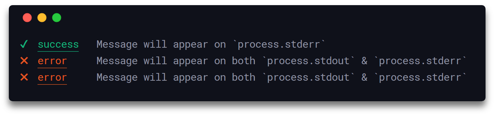

<h1 align="center">
  Signale
</h1>

<h4 align="center">
  Hochgradig konfigurierbares Loggingprogramm
</h4>

<div align="center">
  
</div>

<p align="center">
  <a href="https://travis-ci.com/klaudiosinani/signale">
    
  </a>
  <a href="https://www.npmjs.com/package/signale">
    
  </a>
</p>

## Beschreibung

Signale ist bis ins letzte hack- und konfigurierbar. Es kann für Logging und Statusreports als auch für das Handling des Output Rendering Process von anderen Node Modulen und Anwendungen verwendet werden.

Diese Dokument in [简体中文](https://github.com/klaudiosinani/signale/blob/master/docs/readme.zh_CN.md) lesen.

Lies die [contributing guidelines](https://github.com/klaudiosinani/signale/blob/master/contributing.md#translating-documentation) um zu lernen, wie du dieses Dokument in mehr Sprachen übersetzen kannst.

## Höhepunkte

- 19 out-of-the-box loggers
- durch und durch hackbar
- sauberer, schöner Output
- intergrierte Timer
- benutzerdefinierte Logger
- TypeScript Unterstützung
- Interaktive und reguläre Modi
- Geheimnisse & sensitives Filtern von Informationen
- Unterstützung von Filename, Datum und timestamp 
- gezielte Logger und Timer
- skaliert Loglevel
- Unterstützugn von String interpolation
- mehrere konfigurierbare beschreibbare Streams
- einfache, minimalistische Syntax
- Global konfigurierbar durch `package.json`
- Konfiguration kann per File und Logger überschrieben werden

## Inhalt

- [Beschreibung](#beschreibung)
- [Höhepunkte](#höhepunkte)
- [Installation](#installation)
- [Verwendung](#verwendung)
- [Konfiguration](#konfiguration)
- [API](#api)
- [Development](#development)
- [Related](#related)
- [Wer verwendet es?](#wer-verwendet-es)
- [Team](#team)
- [License](#license)

## Installation

### Yarn

```bash
yarn add signale
```

### NPM

```bash
npm install signale
```

## Verwendung

### Default Loggers

Signale importieren und einen der default Logger verwenden.


<details>
<summary>All verfügbaren Logger anzeigen.</summary>

<br/>

- `await`
- `complete`
- `error`
- `debug`
- `fatal`
- `fav`
- `info`
- `note`
- `pause`
- `pending`
- `star`
- `start`
- `success`
- `wait`
- `warn`
- `watch`
- `log`

</details>

<br/>

```js
const signale = require('signale');

signale.success('Operation successful');
signale.debug('Hello', 'from', 'L59');
signale.pending('Write release notes for %s', '1.2.0');
signale.fatal(new Error('Unable to acquire lock'));
signale.watch('Recursively watching build directory...');
signale.complete({prefix: '[task]', message: 'Fix issue #59', suffix: '(@klaudiosinani)'});
```

<div align="center">
  
</div>

### Benutzerdefinierte Logger

Um einen benutzerdefinierten Logger zu erzeugen, wird ein `options` Objekt mit einem `types` field mit dem Logger definiert. Als argument wird eine neue Signale Instanz übergeben.


```js
const {Signale} = require('signale');

const options = {
  disabled: false,
  interactive: false,
  logLevel: 'info',
  scope: 'custom',
  secrets: [],
  stream: process.stdout,
  types: {
    remind: {
      badge: '**',
      color: 'yellow',
      label: 'reminder',
      logLevel: 'info'
    },
    santa: {
      badge: '🎅',
      color: 'red',
      label: 'santa',
      logLevel: 'info'
    }
  }
};

const custom = new Signale(options);
custom.remind('Improve documentation.');
custom.santa('Hoho! You have an unused variable on L45.');
```

<div align="center">
  
</div>
Ein Beispiel, wo die voreingestellten `error` und `success` Logger überschrieben werden.


```js
const {Signale} = require('signale');

const options = {
  types: {
    error: {
      badge: '!!',
      label: 'fatal error'
    },
    success: {
      badge: '++',
      label: 'huge success'
    }
  }
};

const signale = new Signale();
signale.error('Default Error Log');
signale.success('Default Success Log');

const custom = new Signale(options);
custom.error('Custom Error Log');
custom.success('Custom Success Log');
```

<div align="center">
  
</div>

Das `options` Objekt kann jedes der folgenden Attribute erhalten: `disabled`, `interactive`, `logLevel`, `secrets`, `stream`, `scope` und `types`. 

##### `disabled`

- Type: `Boolean`
- Default: `false`

Verhindert das Logging aller Logger, die zur der Instanz gehören.

##### `interactive`

- Type: `Boolean`
- Default: `false`

Schaltet alle Logger, die zu der Instanz gehören, in den interaktiven Modus.

##### `logLevel`

- Type: `String`
- Default: `'info'`

Setzte den Loglevel der erstellten Instanz. Es kann einer der folgenden Level gewählt werden:

- `'info'` - Zeigt alle Benachrichtigungen von allen Loggern.
- `'timer'` -  Zeigt Benachrichtigungen von den `time`, `timeEnd`, `debug`, `warn`, `error` & `fatal` Loggern.
- `'debug'` - Zeigt Benachrichtigungen von den `debug`, `warn`, `error` & `fatal` Loggern.
- `'warn'` - Zeigt Benachrichtigungen von den `warn`, `error` & `fatal` Loggern.
- `'error'` - Zeigt Benachrichtigungen von den `error` & `fatal` Loggern.

##### `secrets`

- Type: `(String|Number)[]`
- Default: `[]`

Ein Array, in dem geheime/sensitive Informationen angegeben werden können. Diese werden vom Body und den Metadaten der Benachtichtigungen entfernt und mit dem voreingestellten `'[secure]'` String ersetzt.

##### `stream`

- Type: `stream.Writable|stream.Writable[]`
- Default: `process.stdout`

Die Daten werden in dieses Ziel geschrieben. Es kann ein einzelner, gültiger [Writable stream](https://nodejs.org/api/stream.html#stream_writable_streams) oder ein Array mit mehreren Writable streams sein.

##### `scope`

- Type: `String|String[]`

Name des Bereichs für den geloggt wird.

##### `types`

- Type: `Object`

Enthält die Konfiguration der benutzerdefinierten und voreingestellten Logger.

Zusätzlich kann das configuration object von jedem Logger-Type, das in der `types` Option definiert wird, folgende Attibute erhalten: `badge`, `label`, `color`, `logLevel` & `stream`. 

##### `badge`

- Type: `String`

Icon, der zum Logger gehört.


##### `label`

- Type: `String`

Label, das verwendet wird, um den Typ des Loggers zu erkennen.

##### `color`

- Type: `String`

Farbe des Labels. Kann eine der von [chalk](https://github.com/chalk/chalk#colors) unterstützten Farben sein.


##### `logLevel`

- Type: `String`
- Default: `'info'`

Das passende Loglevel für den Logger. Nachrichten vom Logger werden angezeigt, wenn der Loglevel größer oder gleich zum oben beschriebenen generellen Loglevel `logLevel` der `Signale` Instanz ist.

### Zielgerichtete Logger

Um einen neuen Logger für einen bestimmten Bereich zu erstellen, wird das `scope` Feld im `options` Objekt definiert und als Argument an die neue Signale Instanz übergeben.

```js
const {Signale} = require('signale');

const options = {
  scope: 'global scope'
};

const global = new Signale(options);
global.success('Successful Operation');
```

<div align="center">
  
</div>

Um einen Logger für einen besteimmten Bereich, basierend auf einem bereits existierenden Logger, zu erstellen wird die `scope()` Funktion verwendet. Sie retourniert eine neue signale Instanz, die alle benutzerdefinierten Logger, Timer, Geheimnisse, Streams, Konfiguation, Loglevel, Interaktiven Modi und deaktivierten Stati erbt.

```js
const signale = require('signale');

const global = signale.scope('global scope');
global.success('Hello from the global scope');

function foo() {
  const outer = global.scope('outer', 'scope');
  outer.success('Hello from the outer scope');
  
  setTimeout(() => {
    const inner = outer.scope('inner', 'scope'); 
    inner.success('Hello from the inner scope');
  }, 500);
}

foo();
```

<div align="center">
  
</div>

### Interaktive Loggers

Um einen intaktiven Logger zu initialisieren, wird eine neue signale Instanz mit dem Wert `true` im [`interactive`](#interactive) Attribute erzeugt. Während man sich im interaktiven Modus befindet, werden zuvor geloggte Nachrichten von einem anderen interaktiven Logger von den neuen, die von dem gleichen oder einem neuen interaktiven Logger kommen, überschrieben. Reguläre Nachrichten von regulären Loggern werden von interaktiven nicht überschrieben.

```js
const {Signale} = require('signale');

const interactive = new Signale({interactive: true, scope: 'interactive'});

interactive.await('[%d/4] - Process A', 1);

setTimeout(() => {
  interactive.success('[%d/4] - Process A', 2);
  setTimeout(() => {
    interactive.await('[%d/4] - Process B', 3);
    setTimeout(() => {
      interactive.error('[%d/4] - Process B', 4);
      setTimeout(() => {}, 1000);
    }, 1000);
  }, 1000);
}, 1000);
```

<div align="center">
  
</div>

### Writable Streams

Standardmäßig loggen alle Signale Instanzen die Nachrichten in den `process.stdout` stream. Der Ziel-Stream kann durch die [`stream`](#stream) property angepasst werden. Hier kann ein einzelner oder mehrere gütlige Writable streams angegeben werden, welche dann von allen Loggertypen verwendet werden. Zusätzlich ist es möglich einen oder mehrere Wirtable Streams exklusiv für einen spezifischen Loggertypen zu definieren - also Daten unabhängig von den restlichen Loggertypen zu schreiben.

```js
const {Signale} = require('signale');

const options = {
  stream: process.stderr, // All loggers will now write to `process.stderr`
  types: {
    error: {
      // Only `error` will write to both `process.stdout` & `process.stderr`
      stream: [process.stdout, process.stderr]
    }
  }
};

const signale = new Signale(options);
signale.success('Message will appear on `process.stderr`');
signale.error('Message will appear on both `process.stdout` & `process.stderr`');
```

<div align="center">
  
</div>

### Secrets Filtering

Durch das Verwenden der `secrets` Option werden geheime/sensitive Informationen, wie Scopenamen,  aus den Nachrichten (Body und Metadaten) herausgefiltert. Diese Option ist Teil des configuration-Objects, dass einer `Signale`-Instanz oder Initialisierung übergeben wird und hat den Typ `Array<String|Number>`. Das Array kann mehrere Geheimnisse enthalten. Alle werden, wenn sie vorkommen, entfernt und durch den standardmäßigen `'[secure]'` string ersetzt. Wenn die unäre `signale.scope(name)` Funktion verwendet wird, dann erbt die erzeugte `Signale` Instanz alle Geheimnisse des Parents. Die Geheimnisse werden **case-sensitive** überprüft. Die unäre [`signale.addSecrets()`](https://github.com/klaudiosinani/signale#signaleaddsecretssecrets) und die nullstellige [`signale.clearSecrets()`](https://github.com/klaudiosinani/signale#signaleclearsecrets) Funktion sind über die API verfügbar um die Geheimnisse hinzuzufügen/zu löschen.

Es ist **entscheidende** und **stark befürwortete** Praxis, sensitive Informationen **nicht direkt im Quellcode zu speichern**. Das Beispiel ist **alleinig** zur die Demonstration gedacht:

```js
const {Signale} = require('signale');

// In reality secrets could be securely fetched/decrypted through a dedicated API 
const [USERNAME, TOKEN] = ['klaudiosinani', 'token'];

const logger1 = new Signale({
  secrets: [USERNAME, TOKEN]
});

logger1.log('$ exporting USERNAME=%s', USERNAME);
logger1.log('$ exporting TOKEN=%s', TOKEN);

// `logger2` inherits all secrets from its parent `logger1`
const logger2 = logger1.scope('parent');

logger2.log('$ exporting USERNAME=%s', USERNAME);
logger2.log('$ exporting TOKEN=%s', TOKEN);
```

<div align="center">
  
</div>

### Timers

Timer werden von den `time()` und `timeEnd()`  Funktionen verwaltet. Zur Identifikation eines Timers oder einer Initialisierung kann ein einzigartiges Label vewrendet werden. Wenn keines bereitgestellt wird, dann wird eines automatisch generiert. Wenn die `timeEnd()` Funktion ohne ein Label aufgerufen wird, dann wird der als letztes initialisierte Timer terminiert, der ohne Label erstellt wurde.

```js
const signale = require('signale');

signale.time('test');
signale.time();
signale.time();

setTimeout(() => {
  signale.timeEnd();
  signale.timeEnd();
  signale.timeEnd('test');
}, 500);
```

<div align="center">
  
</div>

## Konfiguration

### Global

Um die gloabel Konfiguration zu ermöglichen, müssen die Optionen unter dem`signale` namespace im `package.json` defniert werden.

Das folgende Beispiel zeigt alle verfügbaren Optionen mit den zugehörigen voreingestellten Werten.

```json
{
  "signale": {
    "displayScope": true,
    "displayBadge": true,
    "displayDate": false,
    "displayFilename": false,
    "displayLabel": true,
    "displayTimestamp": false,
    "underlineLabel": true,
    "underlineMessage": false,
    "underlinePrefix": false,
    "underlineSuffix": false,
    "uppercaseLabel": false
  }
}
```

<details>
<summary>Alle verfügbaren Optionen im Detail ansehen.</summary>

##### `displayScope`

- Type: `Boolean`
- Default: `true`

Zeigt den Bereichsnamen des Loggers.

##### `displayBadge`

- Type: `Boolean`
- Default: `true`

Zeigt den Badge des Loggers.

##### `displayDate`

- Type: `Boolean`
- Default: `false`

Zeugt das aktuelle lokale Datum im `YYYY-MM-DD` Format. 

##### `displayFilename`

- Type: `Boolean`
- Default: `false`

Zeigt den Dateinamen vom File, für das der Logger loggt.

##### `displayLabel`

- Type: `Boolean`
- Default: `true`

Zeigt das Label des Loggers.

##### `displayTimestamp`

- Type: `Boolean`
- Default: `false`

Zeigt die lokale Zeit im `HH:MM:SS` Format.

##### `underlineLabel`

- Type: `Boolean`
- Default: `true`

Unterstreicht das Logger-Label.

##### `underlineMessage`

- Type: `Boolean`
- Default: `false`

Unterstreicht die Logger Nachricht.

##### `underlinePrefix`

- Type: `Boolean`
- Default: `false`

Unterstreicht die Logger Prefix.

##### `underlineSuffix`

- Type: `Boolean`
- Default: `false`

Unterstreicht die Logger Suffix.

##### `uppercaseLabel`

- Type: `Boolean`
- Default: `false`

Zeigt das Label des Loggers in Großbuchstaben.

</details>

### Local

Um die lokale Konfiguration zu ermöglichen muss die `config()` Funktion der Signale Instanz aufgerufen werden. Lokale Konfigurationen überschreiben immer die geerbte Konfiguration von `package.json`.

Das folgende Beispiel zeigt wie Logger in der `foo.js`-Datei unter einer eigenen Konfiguation laufen, die die `package.json`-Konfiguration überschreibt.

```js
// foo.js
const signale = require('signale');

// Overrides any existing `package.json` config
signale.config({
  displayFilename: true,
  displayTimestamp: true,
  displayDate: false
}); 

signale.success('Hello from the Global scope');
```

<div align="center">
  
</div>

Logger für bestimmte Bereiche können eine unabhängige, eigene Konfiguration erhalten, die die vom Parent oder vom `package.json` vererbte Konfiguation überschreibt.

```js
// foo.js
const signale = require('signale');

signale.config({
  displayFilename: true,
  displayTimestamp: true,
  displayDate: false
});

signale.success('Hello from the Global scope');

function foo() {
  // `fooLogger` inherits the config of `signale`
  const fooLogger = signale.scope('foo scope');

  // Overrides both `signale` and `package.json` configs
  fooLogger.config({
    displayFilename: true,
    displayTimestamp: false,
    displayDate: true
  });

  fooLogger.success('Hello from the Local scope');
}

foo();
```

<div align="center">
  
</div>

## API

#### signale.`<logger>(message[, message]|messageObj|errorObj)`

##### **`logger`**

- Type: `Function`

Kann jeder vereingestellte oder benutzerdefinierte Logger sein.

##### **`message`**

- Type: `String`

Kann ein oder mehrere durch Kommas getrennte Strings sein.

```js
const signale = require('signale');

signale.success('Successful operation');
//=> ✔  success  Successful operation

signale.success('Successful', 'operation');
//=> ✔  success  Successful operation

signale.success('Successful %s', 'operation');
//=> ✔  success  Successful operation
```

##### **`errorObj`**

- Type: `Error Object`

Kann jedes Error Objekt sein.

```js
const signale = require('signale');

signale.error(new Error('Unsuccessful operation'));
//=> ✖  error  Error: Unsuccessful operation
//        at Module._compile (module.js:660:30)
//        at Object.Module._extensions..js (module.js:671:10)
//        ...
```

##### **`messageObj`**

- Type: `Object`

Kann jedes Objet sein, dass die Attribute `prefix`, `message` und `suffix` enthält, wobei `prefix` und `suffix` immer vor bzw. nach der `message` eingefügt werden.

```js
const signale = require('signale');

signale.complete({prefix: '[task]', message: 'Fix issue #59', suffix: '(@klaudiosinani)'});
//=> [task] ☒  complete  Fix issue #59 (@klaudiosinani)

signale.complete({prefix: '[task]', message: ['Fix issue #%d', 59], suffix: '(@klaudiosinani)'});
//=> [task] ☒  complete  Fix issue #59 (@klaudiosinani)
```

#### signale.`scope(name[, name])`

Definiert den Namen des Loggers.

##### **`name`**

- Type: `String`

Kann ein oder mehrere durch Kommas getrennte Strings sein.

```js
const signale = require('signale');

const foo = signale.scope('foo'); 
const fooBar = signale.scope('foo', 'bar');

foo.success('foo');
//=> [foo] › ✔  success  foo

fooBar.success('foo bar');
//=> [foo] [bar] › ✔  success  foo bar
```

#### signale.`unscope()`

Löscht den Bereichsnamen des Loggers.

```js
const signale = require('signale');

const foo = signale.scope('foo'); 

foo.success('foo');
//=> [foo] › ✔  success  foo

foo.unscope();

foo.success('foo');
//=> ✔  success  foo
```

#### signale.`config(settingsObj)`

Die Konfiguration der Instanz wird gesestzt und überschreibt die existierende lokale oder globale Konfiguration.

##### **`settingsObj`**

- Type: `Object`

Kann jede der dokumentierten [options](#global) enthalten.

```js
// foo.js
const signale = require('signale');

signale.config({
  displayFilename: true,
  displayTimestamp: true,
  displayDate: true
});

signale.success('Successful operations');
//=> [2018-5-15] [11:12:38] [foo.js] › ✔  success  Successful operations
```

#### signale.`time([, label])`

- Return Type: `String`

Setzt einen Timer und aktzeptiert ein optionales Label. Wenn kein Label übergeben wird, dann erhält der Timer automatisch eines.

Retourniert einen String, der das Timerlabel repräsentiert.

##### **`label`**

- Type: `String`

Label, dass zum Timer gehört. Jeder Timer braucht ein einzigartiges Label.

```js
const signale = require('signale');

signale.time();
//=> ▶  timer_0  Initialized timer...

signale.time();
//=> ▶  timer_1  Initialized timer...

signale.time('label');
//=> ▶  label    Initialized timer...
```

#### signale.`timeEnd([, label])`

- Return Type: `Object`

Deaktiviert den Timer, der zu dem Label gehört. Wenn kein Label angegeben wird, dann wird der letzte Timer, der ohne Label erzeugt wurde, deaktiviert.

Retourniert ein Objekt `{label, span}`, welches das Label und die Laufzeit enthält.

##### **`label`**

- Type: `String`

Label, dass zu dem Timer gehört. Jeder Timer hat ein einzigartiges label.

```js
const signale = require('signale');

signale.time();
//=> ▶  timer_0  Initialized timer...

signale.time();
//=> ▶  timer_1  Initialized timer...

signale.time('label');
//=> ▶  label    Initialized timer...

signale.timeEnd();
//=> ◼  timer_1  Timer run for: 2ms

signale.timeEnd();
//=> ◼  timer_0  Timer run for: 2ms

signale.timeEnd('label');
//=> ◼  label    Timer run for: 2ms
```

#### signale.`disable()`

Deaktiviert das Logging für alle Logger die zu einer spezifischen Instanz gehören.

```js
const signale = require('signale');

signale.success('foo');
//=> ✔  success  foo

signale.disable();

signale.success('foo');
//=>
```

#### signale.`enable()`

Aktiviert das Logging für alle Logger die zu einer spezifischen Instanz gehören.
```js
const signale = require('signale');

signale.disable();

signale.success('foo');
//=>

signale.enable();

signale.success('foo');
//=> ✔  success  foo
```

#### signale.`isEnabled()`

Überprüft, ob Logging für die spezifische Instanz aktiviert ist.

```js
const signale = require('signale');

signale.success('foo');
//=> ✔  success  foo

signale.isEnabled();
// => true

signale.disable();

signale.success('foo');
//=>

signale.isEnabled();
// => false
```

#### signale.`addSecrets(secrets)`

Fügt neue geheime/sensitive Informatioen hinzu.

##### **`secrets`**

- Type: `(String|Number)[]`

Array, dass die geheime/sensitive Information enthält, die herausgefiltert werden soll.

```js
const signale = require('signale');

signale.log('$ exporting USERNAME=%s', 'klaudiosinani');
//=> $ exporting USERNAME=klaudiosinani

signale.addSecrets(['klaudiosinani']);

signale.log('$ exporting USERNAME=%s', 'klaudiosinani');
//=> $ exporting USERNAME=[secure]
```

#### signale.`clearSecrets()`

Entfernt alle geheimen/sensitiven Informationen der spezifischen Signale Instanz.

```js
const signale = require('signale');

signale.addSecrets(['klaudiosinani']);

signale.log('$ exporting USERNAME=%s', 'klaudiosinani');
//=> $ exporting USERNAME=[secure]

signale.clearSecrets();

signale.log('$ exporting USERNAME=%s', 'klaudiosinani');
//=> $ exporting USERNAME=klaudiosinani
```

## Development

Mehr Informationen im Bezug auf Beiträge zum Projekt finden sich in den [contributing guidelines](https://github.com/klaudiosinani/signale/blob/master/contributing.md).

- Das Repository forken und auf deine Maschine klonen
- Zum lokalen Fork navigieren: `cd signale`
- Die dependencies installieren: `npm install` oder `yarn install`
- Den Code für Fehler linten: `npm test` or `yarn test`
## Related

- [qoa](https://github.com/klaudiosinani/qoa) - Minimal interactive command-line prompts
- [taskbook](https://github.com/klaudiosinani/taskbook) - Tasks, boards & notes for the command-line habitat
- [hyperocean](https://github.com/klaudiosinani/hyperocean) - Deep oceanic blue Hyper terminal theme

## Who's Using It?

- [Boostnote](https://github.com/BoostIO/Boostnote)
- [Docz](https://github.com/pedronauck/docz)
- [Remix by Ethereum](https://github.com/ethereum/remix)
- [Semantic Release](https://github.com/semantic-release/semantic-release)
- [Shower](https://github.com/shower/shower)
- [Taskbook](https://github.com/klaudiosinani/taskbook)
- [Vant](https://github.com/youzan/vant)

Repositories, die Signale verwenden im Detail ansehen: [hier](https://github.com/klaudiosinani/signale/network/dependents).

## Team

- Klaudio Sinani [(@klaudiosinani)](https://github.com/klaudiosinani)
- Mario Sinani [(@mariosinani)](https://github.com/mariosinani)

## License

[MIT](https://github.com/klaudiosinani/signale/blob/master/license.md)
