<h1 align="center">
  Signale
</h1>

<h4 align="center">
  👋 可扩展的日志记录器
</h4>

<div align="center">
  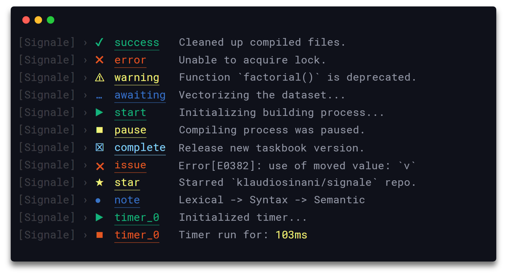
</div>

<p align="center">
  <a href="https://travis-ci.org/klaussinani/signale">
    
  </a>
</p>

## 描述

Signale 的核心是可扩展和可配置的，可将其用于日志记录、状态报告以及处理其他 Node 模块和应用的输出渲染方式。

来 [Gitter](https://gitter.im/klaussinani/signale) 或 [Twitter](https://twitter.com/klaussinani) 分享你对该项目的看法。

浏览 [contributing guidelines](https://github.com/klaussinani/signale/blob/master/contributing.md#translating-documentation) 以了解如何将该文档翻译成其他语言。

## 亮点

- 16个开箱即用的记录器
- 可扩展的核心
- 简洁漂亮的输出
- 集成了计时器
- 自定义可插拔记录器
- 交互模式和常规模式
- 文件名，日期和时间戳支持
- 局部记录器和计时器
- 字符串插值支持
- 多个可配置的输出流
- 简单且简洁的语法
- 可通过 `package.json` 进行全局配置
- 可覆盖每个文件和记录器的配置

## 目录

- [描述](#描述)
- [亮点](#亮点)
- [安装](#安装)
- [使用](#使用)
- [配置](#配置)
- [API](#api)
- [开发](#开发)
- [相关项目](#相关项目)
- [团队](#团队)
- [许可](#许可)

## 安装

```bash
npm install signale
```

## 使用

### 默认记录器

导入 signale 即可开始用任意的默认记录器。

<details>
<summary>查看所有可用的默认记录器。</summary>

<br/>

- `await`
- `complete`
- `error`
- `debug`
- `fatal`
- `alert`
- `fav`
- `info`
- `note`
- `pause`
- `pending`
- `star`
- `start`
- `success`
- `warn`
- `watch`
- `log`

</details>

<br/>

```js
const signale = require('signale');

signale.success('Operation successful');
signale.debug('Hello', 'from', 'L59');
signale.pending('Write release notes for %s', '1.2.0');
signale.fatal(new Error('Unable to acquire lock'));
signale.watch('Recursively watching build directory...');
signale.complete({prefix: '[task]', message: 'Fix issue #59', suffix: '(@klauscfhq)'});
```

<div align="center">
  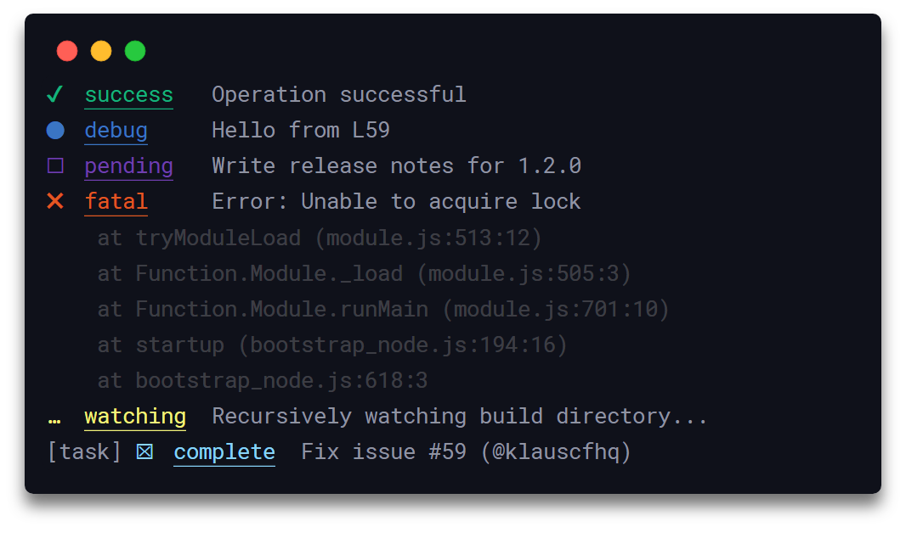
</div>

### 自定义记录器 

要创建自定义记录器，先定义一个 `options` 对象，在其 `types` 属性中填入记录器相关数据，然后将该对象作为参数传递给新的 signale 实例。

```js
const {Signale} = require('signale');

const options = {
  disabled: false,
  interactive: false,
  stream: process.stdout,
  scope: 'custom',
  types: {
    remind: {
      badge: '**',
      color: 'yellow',
      label: 'reminder'
    },
    santa: {
      badge: '🎅',
      color: 'red',
      label: 'santa'
    }
  }
};

const custom = new Signale(options);
custom.remind('Improve documentation.');
custom.santa('Hoho! You have an unused variable on L45.');
```

<div align="center">
  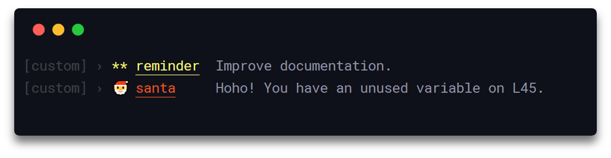
</div>

下面是一个覆盖默认记录器 `error` 和 `success` 的例子

```js
const {Signale} = require('signale');

const options = {
  types: {
    error: {
      badge: '!!',
      label: 'fatal error'
    },
    success: {
      badge: '++',
      label: 'huge success'
    }
  }
};

const signale = new Signale();
signale.error('Default Error Log');
signale.success('Default Success Log');

const custom = new Signale(options);
custom.error('Custom Error Log');
custom.success('Custom Success Log');
```

<div align="center">
  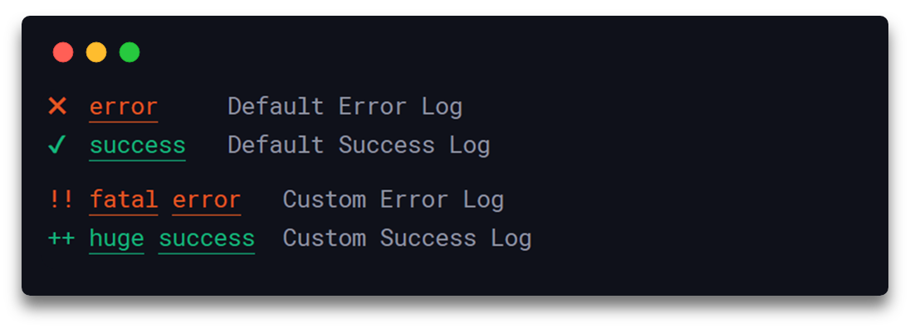
</div>

`options` 对象可以包含以下任何属性： `disabled`, `interactive`, `stream`, `scope` and `types`. 

##### `disabled`

- 类型: `Boolean`
- 默认值: `false`

禁用所创建实例的所有日志记录功能。

##### `interactive`

- 类型: `Boolean`
- 默认值: `false`

将所创建实例的所有记录器切换到交互模式

##### `stream`

- 类型: `Writable stream` (输出流) 或 `Array of Writable streams` (包含输出流的数组)
- 默认: `process.stdout`

写入数据的目标可以是单个有效的 [输出流(Writable stream)](https://nodejs.org/api/stream.html#stream_writable_streams) 或包含多个有效输出流的数组。

##### `scope`

- 类型: `String` 或 `Array of Strings`

记录器的作用域名称。

##### `types`

- 类型: `Object`

持有自定义记录器和默认记录器的配置。

##### `badge`

- 类型: `String`

与记录器对应的徽章图标。

##### `label`

- 类型: `String`

用于标识记录器类型的标签。

##### `color`

- 类型: `String`

标签的颜色，可以是 [chalk](https://github.com/chalk/chalk#colors) 支持的任何前景色。

### 局部记录器

要从头创建局部记录器，需在 `options` 对象的 `scope` 属性中定义作用域名，然后将其作为一个参数传递给新的 signale 实例。

```js
const {Signale} = require('signale');

const options = {
  scope: 'global scope'
};

const global = new Signale(options);
global.success('Successful Operation');
```

<div align="center">
  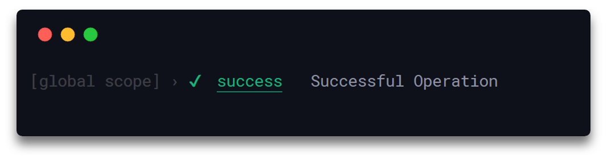
</div>

可以使用 `scope()` 函数基于现有的记录器创建局部记录器，该函数将返回新的signale实例，该实例继承已有实例的所有自定义记录器、计时器、流、配置、禁用状态和交互模式信息。

```js
const signale = require('signale');

const global = signale.scope('global scope');
global.success('Hello from the global scope');

function foo() {
  const outer = global.scope('outer', 'scope');
  outer.success('Hello from the outer scope');
  
  setTimeout(() => {
    const inner = outer.scope('inner', 'scope'); 
    inner.success('Hello from the inner scope');
  }, 500);
}

foo();
```

<div align="center">
  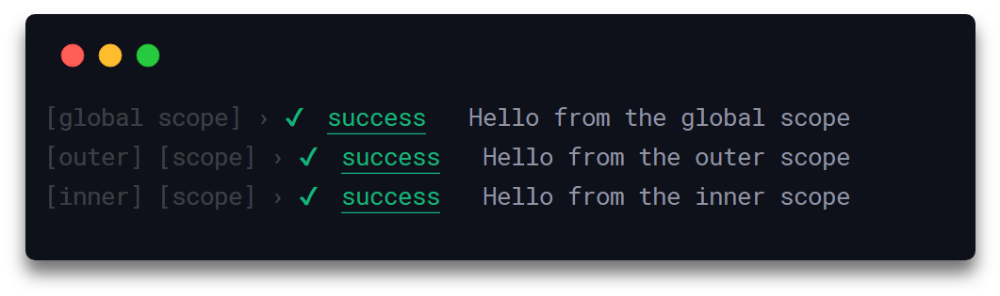
</div>

### 交互式记录器 

要初始化交互式记录器，请创建一个新的 signale 实例，并将 [`interactive`](#interactive) 属性设置为 `true`。 进入交互模式时，之前来自交互式记录器的消息，会被后面来自相同实例中相同或不同的记录器的消息所覆盖。 请注意来自常规记录器的常规消息不会被交互式记录器覆盖。

```js
const {Signale} = require('signale');

const interactive = new Signale({interactive: true, scope: 'interactive'});

interactive.await('[%d/4] - Process A', 1);

setTimeout(() => {
  interactive.success('[%d/4] - Process A', 2);
  setTimeout(() => {
    interactive.await('[%d/4] - Process B', 3);
    setTimeout(() => {
      interactive.error('[%d/4] - Process B', 4);
      setTimeout(() => {}, 1000);
    }, 1000);
  }, 1000);
}, 1000);
```

<div align="center">
  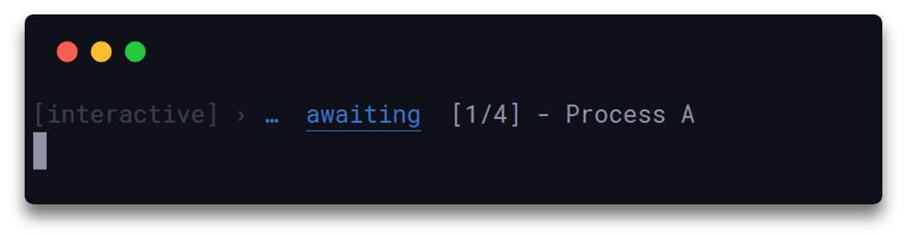
</div>


### 输出流

默认情况下，所有 signale 实例都将其消息记录到 `process.stdout` 输出流。 可以通过 stream 属性进行修改以匹配您自己的选项，你可以在其中定义单个或多个有效的输出流，所有类型的记录器都将使用这些流来记录您的数据。 此外，可以专门为特定记录器类型定义一个或多个可写流，从而独立于其余记录器类型写入数据。

```js
const {Signale} = require('signale');

const options = {
  stream: process.stderr, // 所有的记录器现在都会将数据写入 `process.stderr`
  types: {
    error: {
      // 只有 `error` 记录器会将数据同时写入 `process.stdout` 和 `process.stderr`
      stream: [process.stdout, process.stderr]
    }
  }
};

const signale = new Signale(options);
signale.success('Message will appear on `process.stderr`');
signale.error('Message will appear on both `process.stdout` & `process.stderr`');
```

<div align="center">
  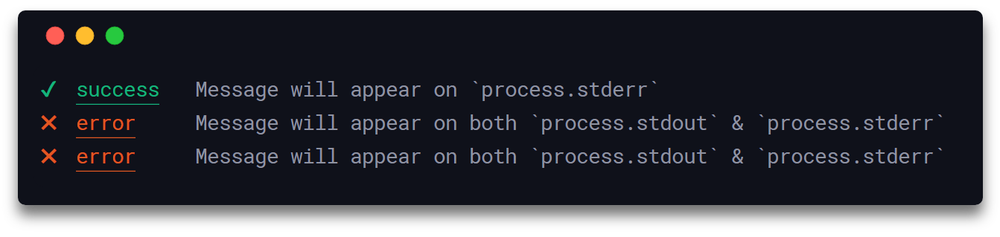
</div>

### 计时器

计时器由 `time()` 和 `timeEnd()` 函数管理。 可以使用标签在初始化时唯一标识一个计时器，如果没有提供则计时器将自动分配一个。 此外，调用没有指定标签的 `timeEnd()` 函数将终止最近一个初始化时没有指定标签的计时器。

```js
const signale = require('signale');

signale.time('test');
signale.time();
signale.time();

setTimeout(() => {
  signale.timeEnd();
  signale.timeEnd();
  signale.timeEnd('test');
}, 500);
```

<div align="center">
  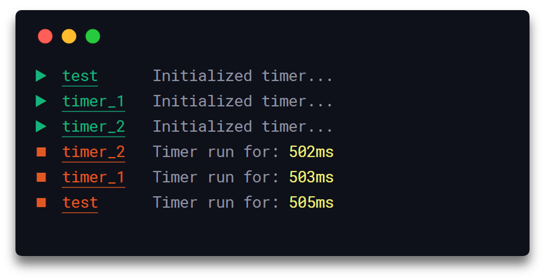
</div>

## 配置

### 全局

在 `package.json` 中的 `signale` 命名空间下定义选项以启用全局配置。

以下说明了所有可用选项及其各自的默认值。

```json
{
  "signale": {
    "coloredInterpolation": false,
    "displayScope": true,
    "displayBadge": true,
    "displayDate": false,
    "displayFilename": false,
    "displayLabel": true,
    "displayTimestamp": false,
    "underlineLabel": true,
    "underlineMessage": false,
    "underlinePrefix": false,
    "underlineSuffix": false,
    "uppercaseLabel": false
  }
}
```

<details>
<summary>浏览所有可用选项的详细信息。</summary>

##### `coloredInterpolation`

- 类型: `Boolean`
- 默认值: `false`

以彩色的方式显示用于替换字符串插值上的占位符标记参数。

##### `displayScope`

- 类型: `Boolean`
- 默认值: `true`

显示记录器的作用域名称。

##### `displayBadge`

- 类型: `Boolean`
- 默认值: `true`

显示记录器的徽章图标。

##### `displayDate`

- 类型: `Boolean`
- 默认值: `false`

以 `YYYY-MM-DD` 的格式显示当前本地日期。

##### `displayFilename`

- 类型: `Boolean`
- 默认值: `false`

显示记录器消息来源的文件名。

##### `displayLabel`

- 类型: `Boolean`
- 默认值: `true`

显示记录器的标签。

##### `displayTimestamp`

- 类型: `Boolean`
- 默认值: `false`

以 `HH:MM:SS` 的格式显示当前本地时间。

##### `underlineLabel`

- 类型: `Boolean`
- 默认值: `true`

给记录器的标签添加下划线。

##### `underlineMessage`

- 类型: `Boolean`
- 默认值: `false`

给记录器的消息内容添加下划线。

##### `underlinePrefix`

- 类型: `Boolean`
- 默认值: `false`

给记录器的前缀添加下划线。

##### `underlineSuffix`

- 类型: `Boolean`
- 默认值: `false`

给记录器的后缀添加下划线。

##### `uppercaseLabel`

- 类型: `Boolean`
- 默认值: `false`

以大写的方式显示记录器的标签。

</details>

### 本地

要启用本地配置，请在您的 signale 实例上调用 `config()` 函数。本地配置将始终覆盖从 `package.json` 继承的任何预先存在的配置。

在以下示例中， `foo.js` 文件中的记录器将在其自己的配置下运行，从而覆盖 `package.json` 文件中的配置。

```js
// foo.js
const signale = require('signale');

// 覆盖任何存在于 `package.json` 的配置
signale.config({
  displayFilename: true,
  displayTimestamp: true,
  displayDate: false
}); 

signale.success('Hello from the Global scope');
```

<div align="center">
  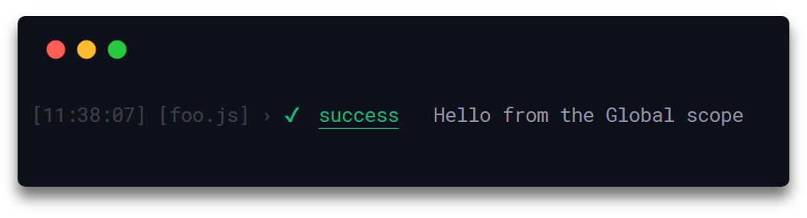
</div>

此外，局部记录器可以拥有自己的独立配置，以覆盖父实例或继承自 `package.json` 的配置。

```js
// foo.js
const signale = require('signale');

signale.config({
  displayFilename: true,
  displayTimestamp: true,
  displayDate: false
});

signale.success('Hello from the Global scope');

function foo() {
  // `fooLogger` 继承了 `signale` 的配置
  const fooLogger = signale.scope('foo scope');

  // 同时覆盖 `signale` 和 `package.json` 的配置
  fooLogger.config({
    displayFilename: true,
    displayTimestamp: false,
    displayDate: true
  });

  fooLogger.success('Hello from the Local scope');
}

foo();
```

<div align="center">
  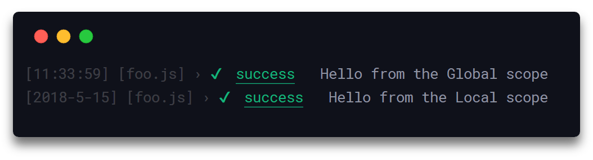
</div>

## API

#### signale.`<logger>(message[, message]|messageObj|errorObj)`

##### **`logger`**

- 类型: `Function`

可以是任何默认或自定义记录器。

##### **`message`**

- 类型: `String`

可以是一个或多个逗号分隔的字符串。

```js
const signale = require('signale');

signale.success('Successful operation');
//=> ✔  success  Successful operation

signale.success('Successful', 'operation');
//=> ✔  success  Successful operation

signale.success('Successful %s', 'operation');
//=> ✔  success  Successful operation
```

##### **`errorObj`**

- 类型: `Error Object`

可以是任意错误 (error) 对象。

```js
const signale = require('signale');

signale.error(new Error('Unsuccessful operation'));
//=> ✖  error  Error: Unsuccessful operation
//        at Module._compile (module.js:660:30)
//        at Object.Module._extensions..js (module.js:671:10)
//        ...
```

##### **`messageObj`**

- 类型: `Object`

可以是包含 `prefix` 、 `message` 和 `suffix` 属性的对象，`prefix` (前缀)和 `suffix` (后缀) 始终预先添加并附加到记录的 `message` (消息)里。

```js
const signale = require('signale');

signale.complete({prefix: '[task]', message: 'Fix issue #59', suffix: '(@klaussinani)'});
//=> [task] ☒  complete  Fix issue #59 (@klaussinani)

signale.complete({prefix: '[task]', message: ['Fix issue #%d', 59], suffix: '(@klaussinani)'});
//=> [task] ☒  complete  Fix issue #59 (@klaussinani)
```

#### signale.`scope(name[, name])`

定义记录器的作用域名称。

##### **`name`**

- 类型: `String`

可以是一个或多个用逗号分隔的字符串。

```js
const signale = require('signale');

const foo = signale.scope('foo'); 
const fooBar = signale.scope('foo', 'bar');

foo.success('foo');
//=> [foo] › ✔  success  foo

fooBar.success('foo bar');
//=> [foo] [bar] › ✔  success  foo bar
```

#### signale.`unscope()`

清除记录器的作用域名称。

```js
const signale = require('signale');

const foo = signale.scope('foo'); 

foo.success('foo');
//=> [foo] › ✔  success  foo

foo.unscope();

foo.success('foo');
//=> ✔  success  foo
```

#### signale.`config(settingsObj)`

设置实例的配置项以覆盖任意已存在的全局或本地配置。

##### **`settingsObj`**

- 类型: `Object`

可以持有任意[配置选项](#全局)。

```js
// foo.js
const signale = require('signale');

signale.config({
  displayFilename: true,
  displayTimestamp: true,
  displayDate: true
});

signale.success('Successful operations');
//=> [2018-5-15] [11:12:38] [foo.js] › ✔  success  Successful operations
```

#### signale.`time([, label])`

- 返回类型: `String`

激活一个计时器并接受一个可选的标签。如果没有提供参数，计时器将自动生成一个唯一的标签。

返回与计时器标签相对应的字符串。

##### **`label`**

- 类型: `String`

与计时器对应的标签。每个计时器必须有自己独有的标签。

```js
const signale = require('signale');

signale.time();
//=> ▶  timer_0  Initialized timer...

signale.time();
//=> ▶  timer_1  Initialized timer...

signale.time('label');
//=> ▶  label    Initialized timer...
```

#### signale.`timeEnd([, label])`

- 返回类型: `Object`

取消激活给定标签对应的计时器。如果未提供标签，则将取消激活在未提供标签的情况下创建的最新的计时器。

返回一个 `{label, span}` 对象，该对象持有计时器的标签与总共运行时间。

##### **`label`**

- 类型: `String`

与计时器对应的标签。每个计时器必须有自己独有的标签。

```js
const signale = require('signale');

signale.time();
//=> ▶  timer_0  Initialized timer...

signale.time();
//=> ▶  timer_1  Initialized timer...

signale.time('label');
//=> ▶  label    Initialized timer...

signale.timeEnd();
//=> ◼  timer_1  Timer run for: 2ms

signale.timeEnd();
//=> ◼  timer_0  Timer run for: 2ms

signale.timeEnd('label');
//=> ◼  label    Timer run for: 2ms
```

#### signale.`disable()`

禁用特定实例包含的所有记录器的记录功能。

```js
const signale = require('signale');

signale.success('foo');
//=> ✔  success  foo

signale.disable();

signale.success('foo');
//=>
```

#### signale.`enable()`

启用特定实例包含的所有记录器的记录功能。

```js
const signale = require('signale');

signale.disable();

signale.success('foo');
//=>

signale.enable();

signale.success('foo');
//=> ✔  success  foo
```

## 开发

想知道如何参与到该项目的更多信息, 请阅读 [contributing guidelines](https://github.com/klaussinani/signale/blob/master/contributing.md) 。

- Fork 该仓库并 clone 到你的本地机器上
- 进入你的本地仓库: `cd signale`
- 安装项目依赖: `npm install` or `yarn install`
- 测试代码: `npm test` or `yarn test`

## 相关项目

- [chalk](https://github.com/chalk/chalk) - Terminal string styling done right
- [figures](https://github.com/sindresorhus/figures) - Unicode symbols

## 团队

- Klaus Sinani [(@klaussinani)](https://github.com/klaussinani)

## 许可

[MIT](https://github.com/klaussinani/signale/blob/master/license.md)
