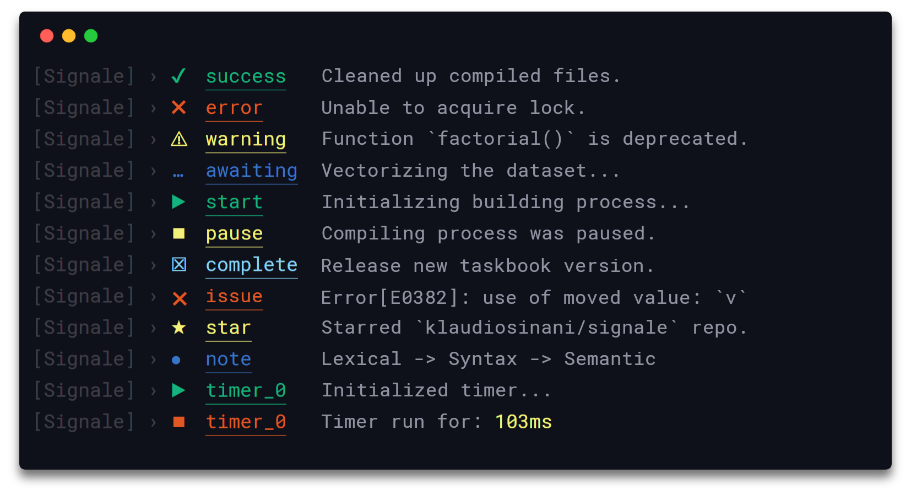
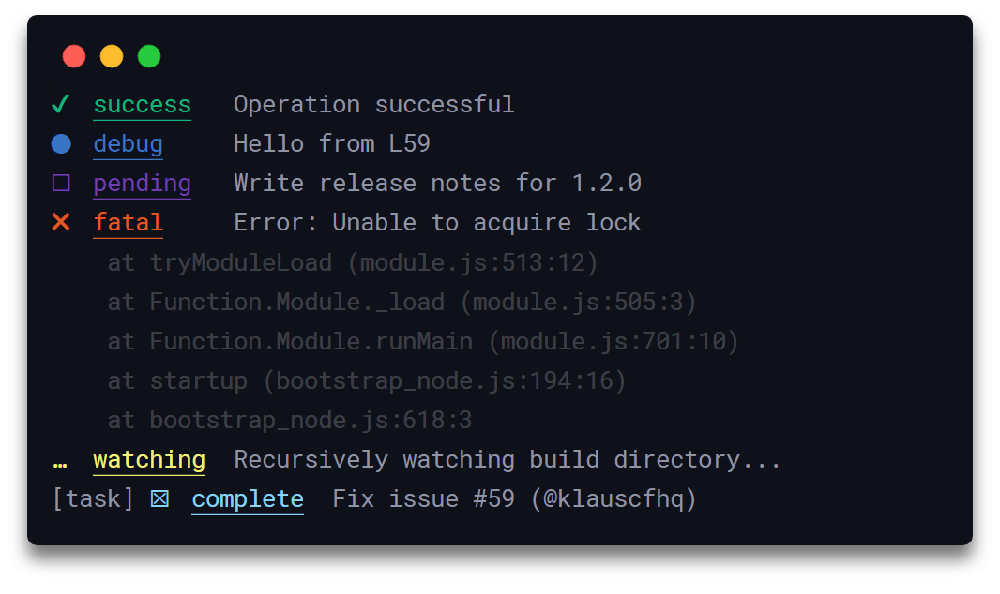
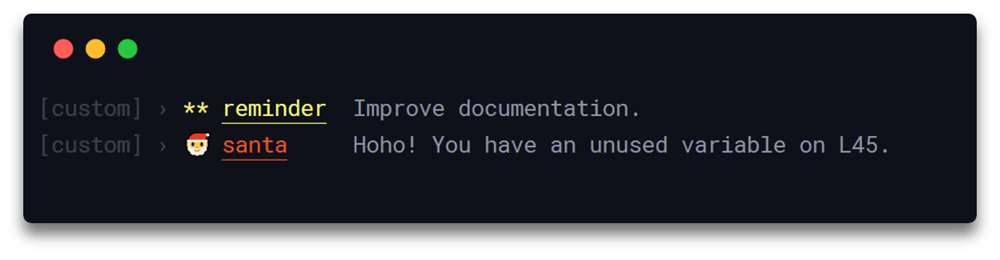
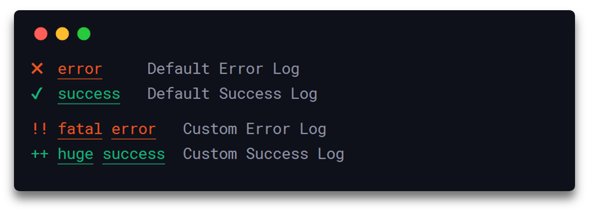
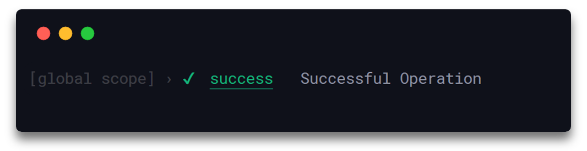
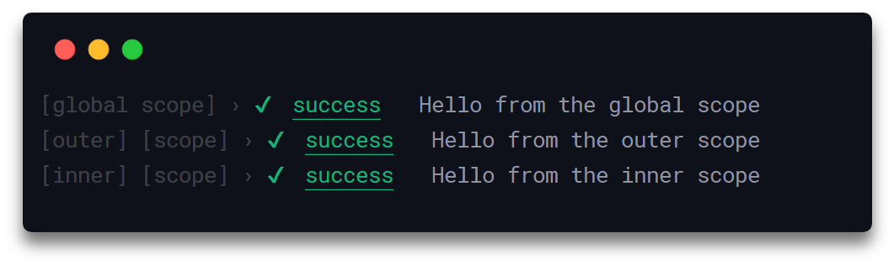
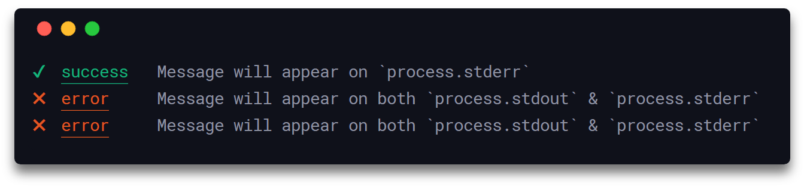
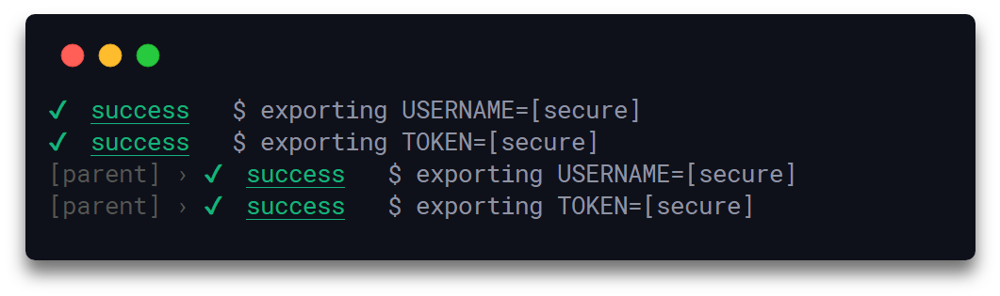
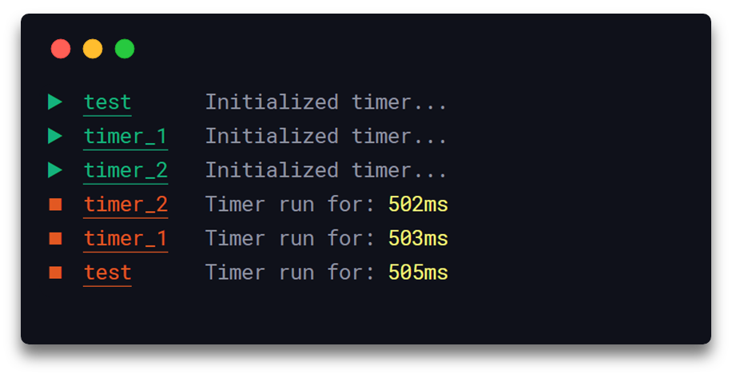
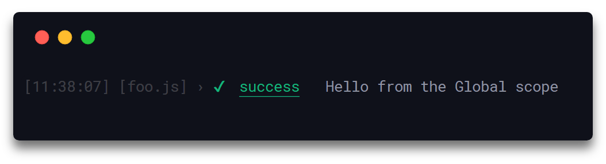

<h1 align="center">
  Signale
</h1>

<h4 align="center">
  👋 Hackable console logger
</h4>

<div align="center">
  
</div>

<p align="center">
  <a href="https://travis-ci.com/klaussinani/signale">
    
  </a>
  <a href="https://www.npmjs.com/package/signale">
    
  </a>
</p>

## Description

Hackable and configurable to the core, signale can be used for logging purposes, status reporting, as well as for handling the output rendering process of other node modules and applications.

Read this document in: [简体中文](https://github.com/klaussinani/signale/blob/master/docs/readme.zh_CN.md).

Visit the [contributing guidelines](https://github.com/klaussinani/signale/blob/master/contributing.md#translating-documentation) to learn more on how to translate this document into more languages.

Come over to [Gitter](https://gitter.im/klaussinani/signale) or [Twitter](https://twitter.com/klaussinani) to share your thoughts on the project.

## Highlights

- 16 out-of-the-box loggers
- Hackable to the core
- Clean and beautiful output
- Integrated timers
- Custom pluggable loggers
- Interactive and regular modes
- Secrets & sensitive information filtering
- Filename, date and timestamp support
- Scoped loggers and timers
- Scaled logging levels mechanism
- String interpolation support
- Multiple configurable writable streams
- Simple and minimal syntax
- Globally configurable through `package.json`
- Overridable configuration per file and logger

## Contents

- [Description](#description)
- [Highlights](#highlights)
- [Install](#install)
- [Usage](#usage)
- [Configuration](#configuration)
- [API](#api)
- [Development](#development)
- [Related](#related)
- [Who's Using It?](#whos-using-it)
- [Team](#team)
- [License](#license)

## Install

```bash
npm install signale
```

## Usage

### Default Loggers

Import signale and start using any of the default loggers.

<details>
<summary>View all of the available loggers.</summary>

<br/>

- `await`
- `complete`
- `error`
- `debug`
- `fatal`
- `fav`
- `info`
- `note`
- `pause`
- `pending`
- `star`
- `start`
- `success`
- `wait`
- `warn`
- `watch`
- `log`

</details>

<br/>

```js
const signale = require('signale');

signale.success('Operation successful');
signale.debug('Hello', 'from', 'L59');
signale.pending('Write release notes for %s', '1.2.0');
signale.fatal(new Error('Unable to acquire lock'));
signale.watch('Recursively watching build directory...');
signale.complete({prefix: '[task]', message: 'Fix issue #59', suffix: '(@klauscfhq)'});
```

<div align="center">
  
</div>

### Custom Loggers

To create a custom logger define an `options` object yielding a `types` field with the logger data and pass it as argument to a new signale instance.

```js
const {Signale} = require('signale');

const options = {
  disabled: false,
  interactive: false,
  logLevel: 'info',
  scope: 'custom',
  secrets: [],
  stream: process.stdout,
  types: {
    remind: {
      badge: '**',
      color: 'yellow',
      label: 'reminder',
      logLevel: 'info'
    },
    santa: {
      badge: '🎅',
      color: 'red',
      label: 'santa',
      logLevel: 'info'
    }
  }
};

const custom = new Signale(options);
custom.remind('Improve documentation.');
custom.santa('Hoho! You have an unused variable on L45.');
```

<div align="center">
  
</div>

Here is an example where we override the default `error` and `success` loggers.

```js
const {Signale} = require('signale');

const options = {
  types: {
    error: {
      badge: '!!',
      label: 'fatal error'
    },
    success: {
      badge: '++',
      label: 'huge success'
    }
  }
};

const signale = new Signale();
signale.error('Default Error Log');
signale.success('Default Success Log');

const custom = new Signale(options);
custom.error('Custom Error Log');
custom.success('Custom Success Log');
```

<div align="center">
  
</div>

The `options` object can hold any of the following attributes: `disabled`, `interactive`, `stream`, `scope` and `types`. 

##### `disabled`

- Type: `Boolean`
- Default: `false`

Disables the logging functionality of all loggers belonging to the created instance.

##### `interactive`

- Type: `Boolean`
- Default: `false`

Switches all loggers belonging to the created instance into the interactive mode.

##### `logLevel`

- Type: `String`
- Default: `'info'`

Sets the general logging level of the created instance. Can be `'info'` - logs all messages of all loggers, `'timer'` - logs only messages of `time`, `timeEnd`, `debug`, `warn`, `error` & `fatal` loggers, `'debug'` - logs only messages of `debug`, `warn`, `error` & `fatal` loggers, `'warn'` - logs only messages of `warn`, `error` & `fatal` loggers & `'error'` - logs only messages of `error` & `fatal` loggers.

##### `secrets`

- Type: `(String|Number)[]`
- Default: `[]`

An array holding secrets/sensitive-information to be removed from the body and metadata of to-be-logged messages and replaced with the default `'[secure]'` string.

##### `stream`

- Type: `stream.Writable|stream.Writable[]`
- Default: `process.stdout`

Destination to which the data is written, can be a single valid [Writable stream](https://nodejs.org/api/stream.html#stream_writable_streams) or an array holding multiple valid Writable streams.

##### `scope`

- Type: `String|String[]`

Name of the scope the logger is reporting from.

##### `types`

- Type: `Object`

Holds the configuration of the custom and default loggers.

Additionally, the configuration object of each custom/default logger type, defined in the `types` option, can hold any of the following attributes: `badge`, `label`, `color` and `logLevel`. 

##### `badge`

- Type: `String`

The icon corresponding to the logger.

##### `label`

- Type: `String`

The label used to identify the type of the logger.

##### `color`

- Type: `String`

The color of the label, can be any of the foreground colors supported by [chalk](https://github.com/chalk/chalk#colors).

##### `logLevel`

- Type: `String`
- Default: `'info'`

The log level corresponding to the logger. Messages originating from the logger are displayed only if the log level is greater or equal to the above described general logging level `logLevel` of the `Signale` instance.

### Scoped Loggers

To create a scoped logger from scratch, define the `scope` field inside the `options` object and pass it as argument to a new signale instance.

```js
const {Signale} = require('signale');

const options = {
  scope: 'global scope'
};

const global = new Signale(options);
global.success('Successful Operation');
```

<div align="center">
  
</div>

To create a scoped logger based on an already existing one, use the `scope()` function, which will return a new signale instance, inheriting all custom loggers, timers, streams, configuration, interactive mode & disabled statuses from the initial one.

```js
const signale = require('signale');

const global = signale.scope('global scope');
global.success('Hello from the global scope');

function foo() {
  const outer = global.scope('outer', 'scope');
  outer.success('Hello from the outer scope');
  
  setTimeout(() => {
    const inner = outer.scope('inner', 'scope'); 
    inner.success('Hello from the inner scope');
  }, 500);
}

foo();
```

<div align="center">
  
</div>

### Interactive Loggers

To initialize an interactive logger, create a new signale instance with the [`interactive`](#interactive) attribute set to `true`. While into the interactive mode, previously logged messages originating from an interactive logger, will be overridden only by new ones originating from the same or a different interactive logger. Note that regular messages originating from regular loggers are not overridden by the interactive ones.

```js
const {Signale} = require('signale');

const interactive = new Signale({interactive: true, scope: 'interactive'});

interactive.await('[%d/4] - Process A', 1);

setTimeout(() => {
  interactive.success('[%d/4] - Process A', 2);
  setTimeout(() => {
    interactive.await('[%d/4] - Process B', 3);
    setTimeout(() => {
      interactive.error('[%d/4] - Process B', 4);
      setTimeout(() => {}, 1000);
    }, 1000);
  }, 1000);
}, 1000);
```

<div align="center">
  
</div>

### Writable Streams

By default, all signale instances log their messages to the `process.stdout` stream. This can be modified, to match your own preference, through the [`stream`](#stream) property, where you can define a single or multiple valid Writable streams, which will be used by all logger types to log your data. Additionally, it is possible to define one or more Writable streams exclusively for a specific logger type, thus write data independently from the rest logger types.

```js
const {Signale} = require('signale');

const options = {
  stream: process.stderr, // All loggers will now write to `process.stderr`
  types: {
    error: {
      // Only `error` will write to both `process.stdout` & `process.stderr`
      stream: [process.stdout, process.stderr]
    }
  }
};

const signale = new Signale(options);
signale.success('Message will appear on `process.stderr`');
signale.error('Message will appear on both `process.stdout` & `process.stderr`');
```

<div align="center">
  
</div>

### Secrets Filtering

By utilizing the `secrets` option, secrets and other sensitive information can be filtered out from the body as well as the metadata, i.e. scope names etc, of to-be-logged messages. The option is part of the configuration object passed to a `Signale` instance on its initialization, and is of type `Array<String|Number>`. The array can hold multiple secrets, all of which are removed, if present, from the to-be-logged messages and are replaced with the default `'[secure]'` string. Additionally, when the unary `signale.scope(name)` function is used, the returned `Signale` instance inherits all the secrets belonging to its parent. The secrets checking process is performed in a **case-sensitive** manner. Also, the unary [`signale.addSecrets()`](https://github.com/klaussinani/signale#signaleaddsecretssecrets) and the nullary [`signale.clearSecrets()`](https://github.com/klaussinani/signale#signaleclearsecrets) functions are available through the API for adding and clearing secrets respectively.

It is **critical** and **highly recommended** to **not type directly secrets in your code**, thus the following example serves **only** as a simple & easily reproducible usage demonstration.

```js
const {Signale} = require('signale');

// In reality secrets could be securely fetched/decrypted through a dedicated API 
const [USERNAME, TOKEN] = ['klaussinani', 'token'];

const logger1 = new Signale({
  secrets: [USERNAME, TOKEN]
});

logger1.log('$ exporting USERNAME=%s', USERNAME);
logger1.log('$ exporting TOKEN=%s', TOKEN);

// `logger2` inherits all secrets from its parent `logger1`
const logger2 = logger1.scope('parent');

logger2.log('$ exporting USERNAME=%s', USERNAME);
logger2.log('$ exporting TOKEN=%s', TOKEN);
```

<div align="center">
  
</div>

### Timers

Timer are managed by the `time()` and `timeEnd()` functions. A unique label can be used to identify a timer on initialization, though if none is provided the timer will be assigned one automatically. In addition, calling the `timeEnd()` function without a specified label will have as effect the termination of the most recently initialized timer, that was created without providing a label.

```js
const signale = require('signale');

signale.time('test');
signale.time();
signale.time();

setTimeout(() => {
  signale.timeEnd();
  signale.timeEnd();
  signale.timeEnd('test');
}, 500);
```

<div align="center">
  
</div>

## Configuration

### Global

To enable global configuration define the options under the `signale` namespace in your `package.json`.

The following illustrates all the available options with their respective default values.

```json
{
  "signale": {
    "displayScope": true,
    "displayBadge": true,
    "displayDate": false,
    "displayFilename": false,
    "displayLabel": true,
    "displayTimestamp": false,
    "underlineLabel": true,
    "underlineMessage": false,
    "underlinePrefix": false,
    "underlineSuffix": false,
    "uppercaseLabel": false
  }
}
```

<details>
<summary>View all of the available options in detail.</summary>

##### `displayScope`

- Type: `Boolean`
- Default: `true`

Display the scope name of the logger. 

##### `displayBadge`

- Type: `Boolean`
- Default: `true`

Display the badge of the logger.

##### `displayDate`

- Type: `Boolean`
- Default: `false`

Display the current local date in `YYYY-MM-DD` format. 

##### `displayFilename`

- Type: `Boolean`
- Default: `false`

Display the name of the file that the logger is reporting from.

##### `displayLabel`

- Type: `Boolean`
- Default: `true`

Display the label of the logger.

##### `displayTimestamp`

- Type: `Boolean`
- Default: `false`

Display the current local time in `HH:MM:SS` format.

##### `underlineLabel`

- Type: `Boolean`
- Default: `true`

Underline the logger label.

##### `underlineMessage`

- Type: `Boolean`
- Default: `false`

Underline the logger message.

##### `underlinePrefix`

- Type: `Boolean`
- Default: `false`

Underline the logger prefix.

##### `underlineSuffix`

- Type: `Boolean`
- Default: `false`

Underline the logger suffix.

##### `uppercaseLabel`

- Type: `Boolean`
- Default: `false`

Display the label of the logger in uppercase.

</details>

### Local

To enable local configuration call the `config()` function on your signale instance. Local configurations will always override any pre-existing configuration inherited from `package.json`.

In the following example, loggers in the `foo.js` file will run under their own configuration, overriding the `package.json` one.

```js
// foo.js
const signale = require('signale');

// Overrides any existing `package.json` config
signale.config({
  displayFilename: true,
  displayTimestamp: true,
  displayDate: false
}); 

signale.success('Hello from the Global scope');
```

<div align="center">
  
</div>

Also, scoped loggers can have their own independent configuration, overriding the one inherited by the parent instance or `package.json`. 

```js
// foo.js
const signale = require('signale');

signale.config({
  displayFilename: true,
  displayTimestamp: true,
  displayDate: false
});

signale.success('Hello from the Global scope');

function foo() {
  // `fooLogger` inherits the config of `signale`
  const fooLogger = signale.scope('foo scope');

  // Overrides both `signale` and `package.json` configs
  fooLogger.config({
    displayFilename: true,
    displayTimestamp: false,
    displayDate: true
  });

  fooLogger.success('Hello from the Local scope');
}

foo();
```

<div align="center">
  
</div>

## API

#### signale.`<logger>(message[, message]|messageObj|errorObj)`

##### **`logger`**

- Type: `Function`

Can be any default or custom logger.

##### **`message`**

- Type: `String`

Can be one or more comma delimited strings.

```js
const signale = require('signale');

signale.success('Successful operation');
//=> ✔  success  Successful operation

signale.success('Successful', 'operation');
//=> ✔  success  Successful operation

signale.success('Successful %s', 'operation');
//=> ✔  success  Successful operation
```

##### **`errorObj`**

- Type: `Error Object`

Can be any error object.

```js
const signale = require('signale');

signale.error(new Error('Unsuccessful operation'));
//=> ✖  error  Error: Unsuccessful operation
//        at Module._compile (module.js:660:30)
//        at Object.Module._extensions..js (module.js:671:10)
//        ...
```

##### **`messageObj`**

- Type: `Object`

Can be an object holding the `prefix`, `message` and `suffix` attributes, with `prefix` and `suffix` always prepended and appended respectively to the logged `message`.

```js
const signale = require('signale');

signale.complete({prefix: '[task]', message: 'Fix issue #59', suffix: '(@klaussinani)'});
//=> [task] ☒  complete  Fix issue #59 (@klaussinani)

signale.complete({prefix: '[task]', message: ['Fix issue #%d', 59], suffix: '(@klaussinani)'});
//=> [task] ☒  complete  Fix issue #59 (@klaussinani)
```

#### signale.`scope(name[, name])`

Defines the scope name of the logger.

##### **`name`**

- Type: `String`

Can be one or more comma delimited strings.

```js
const signale = require('signale');

const foo = signale.scope('foo'); 
const fooBar = signale.scope('foo', 'bar');

foo.success('foo');
//=> [foo] › ✔  success  foo

fooBar.success('foo bar');
//=> [foo] [bar] › ✔  success  foo bar
```

#### signale.`unscope()`

Clears the scope name of the logger.

```js
const signale = require('signale');

const foo = signale.scope('foo'); 

foo.success('foo');
//=> [foo] › ✔  success  foo

foo.unscope();

foo.success('foo');
//=> ✔  success  foo
```

#### signale.`config(settingsObj)`

Sets the configuration of an instance overriding any existing global or local configuration.

##### **`settingsObj`**

- Type: `Object`

Can hold any of the documented [options](#global).

```js
// foo.js
const signale = require('signale');

signale.config({
  displayFilename: true,
  displayTimestamp: true,
  displayDate: true
});

signale.success('Successful operations');
//=> [2018-5-15] [11:12:38] [foo.js] › ✔  success  Successful operations
```

#### signale.`time([, label])`

- Return Type: `String`

Sets a timers and accepts an optional label. If none provided the timer will receive a unique label automatically.

Returns a string corresponding to the timer label. 

##### **`label`**

- Type: `String`

Label corresponding to the timer. Each timer must have its own unique label.

```js
const signale = require('signale');

signale.time();
//=> ▶  timer_0  Initialized timer...

signale.time();
//=> ▶  timer_1  Initialized timer...

signale.time('label');
//=> ▶  label    Initialized timer...
```

#### signale.`timeEnd([, label])`

- Return Type: `Object`

Deactivates the timer to which the given label corresponds. If no label is provided the most recent timer, that was created without providing a label, will be deactivated.

Returns an object `{label, span}` holding the timer label and the total running time.

##### **`label`**

- Type: `String`

Label corresponding to the timer, each timer has its own unique label.

```js
const signale = require('signale');

signale.time();
//=> ▶  timer_0  Initialized timer...

signale.time();
//=> ▶  timer_1  Initialized timer...

signale.time('label');
//=> ▶  label    Initialized timer...

signale.timeEnd();
//=> ◼  timer_1  Timer run for: 2ms

signale.timeEnd();
//=> ◼  timer_0  Timer run for: 2ms

signale.timeEnd('label');
//=> ◼  label    Timer run for: 2ms
```

#### signale.`disable()`

Disables the logging functionality of all loggers belonging to a specific instance.

```js
const signale = require('signale');

signale.success('foo');
//=> ✔  success  foo

signale.disable();

signale.success('foo');
//=>
```

#### signale.`enable()`

Enables the logging functionality of all loggers belonging to a specific instance.

```js
const signale = require('signale');

signale.disable();

signale.success('foo');
//=>

signale.enable();

signale.success('foo');
//=> ✔  success  foo
```

#### signale.`isEnabled()`

Checks whether the logging functionality of a specific instance is enabled.

```js
const signale = require('signale');

signale.success('foo');
//=> ✔  success  foo

signale.isEnabled();
// => true

signale.disable();

signale.success('foo');
//=>

signale.isEnabled();
// => false
```

#### signale.`addSecrets(secrets)`

Adds new secrets/sensitive-information to the targeted Signale instance.

##### **`secrets`**

- Type: `(String|Number)[]`

Array holding the secrets/sensitive-information to be filtered out.

```js
const signale = require('signale');

signale.log('$ exporting USERNAME=%s', 'klaussinani');
//=> $ exporting USERNAME=klaussinani

signale.addSecrets(['klaussinani']);

signale.log('$ exporting USERNAME=%s', 'klaussinani');
//=> $ exporting USERNAME=[secure]
```

#### signale.`clearSecrets()`

Removes all secrets/sensitive-information from the targeted Signale instance.

```js
const signale = require('signale');

signale.addSecrets(['klaussinani']);

signale.log('$ exporting USERNAME=%s', 'klaussinani');
//=> $ exporting USERNAME=[secure]

signale.clearSecrets();

signale.log('$ exporting USERNAME=%s', 'klaussinani');
//=> $ exporting USERNAME=klaussinani
```

## Development

For more info on how to contribute to the project, please read the [contributing guidelines](https://github.com/klaussinani/signale/blob/master/contributing.md).

- Fork the repository and clone it to your machine
- Navigate to your local fork: `cd signale`
- Install the project dependencies: `npm install` or `yarn install`
- Lint code for errors: `npm test` or `yarn test`

## Related

- [qoa](https://github.com/klaussinani/qoa) - Minimal interactive command-line prompts
- [taskbook](https://github.com/klaussinani/taskbook) - Tasks, boards & notes for the command-line habitat
- [hyperocean](https://github.com/klaussinani/hyperocean) - Deep oceanic blue Hyper terminal theme

## Who's Using It?

- [Boostnote](https://github.com/BoostIO/Boostnote)
- [Docz](https://github.com/pedronauck/docz)
- [Remix by Ethereum](https://github.com/ethereum/remix)
- [Semantic Release](https://github.com/semantic-release/semantic-release)
- [Shower](https://github.com/shower/shower)
- [Taskbook](https://github.com/klaussinani/taskbook)
- [Vant](https://github.com/youzan/vant)

View in detail all the packages and repositories that are using Signale [here](https://github.com/klaussinani/signale/network/dependents).

## Team

- Klaus Sinani [(@klaussinani)](https://github.com/klaussinani)

## License

[MIT](https://github.com/klaussinani/signale/blob/master/license.md)
